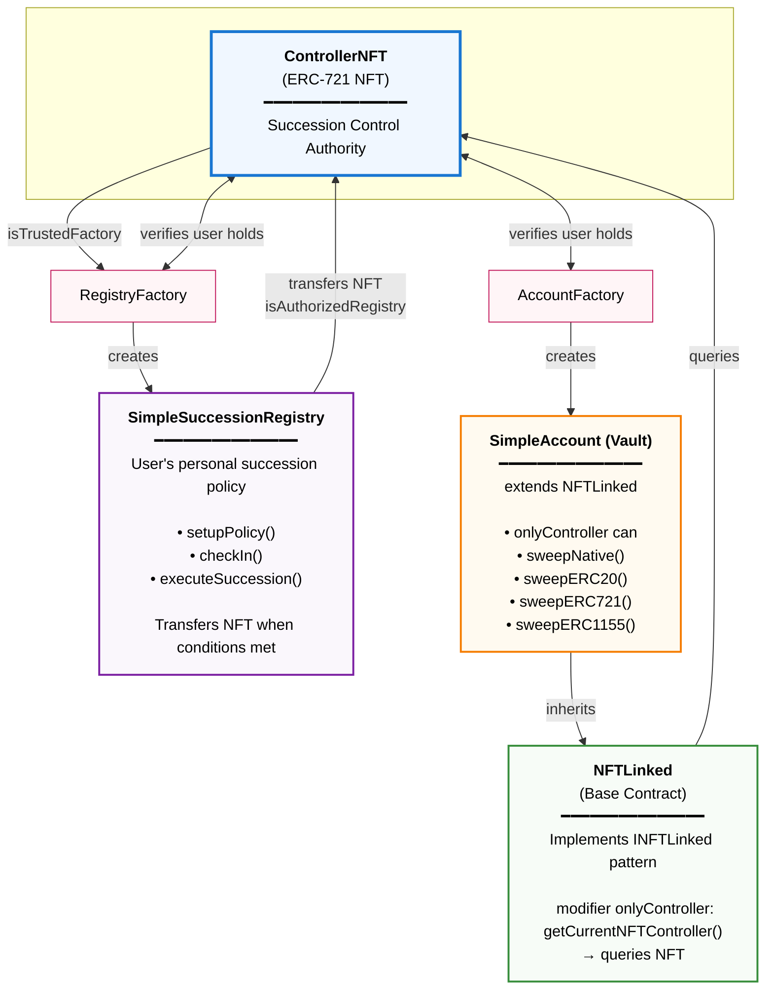

# Reference Implementation

This directory contains the reference implementation of ERC-XXXX: Succession-Controlled Accounts.

**Terminology Note:** This document uses "successor" to describe the person designated to gain control after succession conditions are met. The reference implementation code uses `beneficiary` as the variable name for this address. These terms refer to the same concept.

## Important Notice

This is a **reference implementation** demonstrating ONE valid approach to building succession-enabled systems. The core standard (INFTLinked, IControllerNFT, ISuccessionRegistry) is minimal and flexible. Alternative implementations using different strategies are equally valid and encouraged.

**For production deployments:**
- ✓ Complete professional security audit
- ✓ Test thoroughly on testnets
- ✓ Review all security considerations
- ✓ Implement monitoring and emergency procedures

---

## Overview

The reference implementation demonstrates ONE valid approach to succession-enabled systems. The core power comes from the **INFTLinked pattern** - a minimal interface that makes any contract succession-capable.

**Core Design Philosophy:**
- **INFTLinked is the foundation** - Any contract implementing this interface gains automatic succession
- **Minimal interfaces enable maximum flexibility** - The standard defines "what" (three required interfaces), implementations choose "how" (policy logic, account types, protection strategies)
- **This reference shows one path** - Time-based policies + multi-asset vaults + Storage Limits protection

**Core Design Choices:**
- **Succession Protection:** Storage Limits strategy (MAX_INHERITED_TOKENS = 8)
- **Policy Type:** Time-based inactivity with proof-of-life check-ins
- **Deployment:** EIP-1167 minimal proxies (~81% gas savings)
- **Account Type:** Multi-asset vault (ERC20/721/1155 + native)

**Alternative Approaches:** Other implementations could use different griefing protection strategies (off-chain indexing, access control, etc.), different policy types (guardian-approved, oracle-triggered), or different account types (ERC-6551, ERC-4626 trust vaults).

---

## Repository Structure

```
contracts/
├── interfaces/                          # Standard interfaces (CC0-1.0)
│   ├── INFTLinked.sol
│   ├── IControllerNFT.sol
│   └── ISuccessionRegistry.sol
│
├── deployment/                          # Factory interfaces (CC0-1.0)
│   ├── IRegistryFactory.sol
│   └── IAccountFactory.sol
│
└── reference/                           # Reference implementations (MIT)
    ├── NFTLinked.sol                    # Base contract for INFTLinked
    ├── ControllerNFT.sol                # Succession-enabled NFT
    ├── SimpleSuccessionRegistry.sol     # Time-based succession
    ├── RegistryFactory.sol              # Registry deployment
    │
    ├── vault/                           # Vault implementations
    │   ├── AccountFactory.sol           # Account deployment
    │   ├── IControlledAccount.sol       # Vault interface
    │   └── SimpleAccount.sol            # Multi-asset vault
    │
    └── README.md                        # This file
```

---

## Architecture


**Key Relationships:**

- **NFTLinked:** Foundation pattern - makes contracts succession-capable
- **ControllerNFT:** Central authority - represents control
- **Factories:** Verify NFT ownership & deploy clones
- **Registry:** Personal policy - manages & transfers NFT
- **Account:** INFTLinked implementation - control follows NFT

**Succession Flow:**
1. Registry transfers NFT from owner to successor
2. Account queries `getCurrentNFTController()` which returns successor
3. Successor can now call `onlyController` functions

---

## Succession Flow

**Setup Phase:**
```
1. User mints Controller NFT
2. RegistryFactory deploys registry + auto-authorizes
3. User configures policy (successor address, wait period)
4. AccountFactory deploys vault(s)
5. User funds vaults
```

**Active Phase:**
```
6. User calls registry.checkIn() periodically (resets timer)
7. Vaults query getCurrentNFTController() for access control
```

**Succession Phase:**
```
8. Wait period expires (e.g., 1 year of inactivity)
9. Successor calls registry.executeSuccession()
   → NFT transfers from owner to successor
10. Vaults automatically recognize new controller (no state update needed)
```

**Post-Succession:**
```
11. Successor sweeps assets from vaults
12. Successor optionally burns inherited NFT (frees storage)
13. Successor can configure their own succession policy
```

---

## Components

### Core Implementations

#### **NFTLinked.sol**

Abstract base contract implementing INFTLinked pattern. **This is the foundation that enables succession.**

**Location:** `contracts/reference/NFTLinked.sol`

**Purpose:** Provides the foundation for succession-enabled contracts. Any contract inheriting from NFTLinked automatically gains succession capabilities - control transfers automatically when the Controller NFT transfers, with no state changes needed in the linked contract.

**What Makes It Special:**
- **Automatic succession** - No state updates needed when NFT transfers
- **Simple integration** - Just inherit and use `onlyController` modifier  
- **Universal pattern** - Works with any contract type (vaults, ERC-6551, ERC-4626, custom)

**Key Features:**
- Immutable NFT linking (set once during initialization)
- `onlyController` modifier for access control
- Automatic succession recognition (queries NFT for current controller)
- Protected initialization (prevents re-initialization)

**Usage:**
```solidity
contract MyVault is NFTLinked {
    function initialize(
        address _controllerNFT,
        address _originalHolder
    ) external initializer {
        _initializeNFTLinking(_controllerNFT, _originalHolder);
        // Your initialization logic
    }
    
    function withdraw() external onlyController {
        // Only current NFT controller can call
        // Control automatically updates when NFT transfers
        // No state changes needed in this contract
    }
}
```

**This is the key abstraction** - any contract implementing INFTLinked becomes succession-enabled.

---

#### **ControllerNFT.sol**

Succession-enabled ERC-721 NFT with Storage Limits strategy.

**Location:** `contracts/reference/ControllerNFT.sol`

**Key Features:**
- One mint per address (primary authority)
- Registry-only transfers (blocks standard ERC-721 transfers)
- Factory auto-authorization support
- Storage Limits protection (MAX_INHERITED_TOKENS = 8)
- Burn function for clearing spam

**Storage Limits Implementation:**

```solidity
uint256 public constant MAX_INHERITED_TOKENS = 8;

// Track owned tokens for limit enforcement
mapping(address => uint256[]) private userOwnedTokens;

function burn(uint256 tokenId) external {
    // Can only burn an owned tokens
    if (_ownerOf(tokenId) != msg.sender) revert NotAuthorized();
    
    // Cannot burn originally minted token
    if (originalTokenId[msg.sender] == tokenId) revert CannotBurnOriginalToken();
    
    _burn(tokenId);
    emit ControllerNFTBurned(msg.sender, tokenId);
}
```

**Why Storage Limits:**
- Prevents DoS via unlimited NFT spam
- Bounded gas costs (max 8 iterations)
- Clear recovery path (burn unwanted tokens)
- Simple to audit

**See:** EIP Security Requirements section for alternative strategies (off-chain indexing, access control, pagination, etc.)

---

#### **SimpleSuccessionRegistry.sol**

Time-based succession registry with Storage Limits integration.

**Location:** `contracts/reference/SimpleSuccessionRegistry.sol`

**Policy Type:**
- Time-based inactivity with check-in proof-of-life
- Wait periods: 6 months or 1 year
- Single successor per policy

**Alternative Policy Types (Other Implementations):**
- Guardian approvals (M-of-N multisig requiring guardian signatures)
- Oracle verification (verified off-chain events like death certificates)
- DAO-voted (governance approves succession execution)
- Multi-successor distributions (split or gradual release)
- Conditional transfers (based on on-chain conditions)

**Why Alternative Policies Are Valid:**
The minimal ISuccessionRegistry interface requires only `executeSuccession()`. Implementations can add any policy logic (guardians, oracles, governance) as long as they:
1. Implement `executeSuccession()` 
2. Protect against succession griefing
3. Transfer the NFT when conditions are met

**Key Features:**
- Proof-of-life check-in mechanism
- Single successor with update capability
- Partial transfer support (handles storage limits gracefully)
- Priority transfer (original NFT transferred first)

**Check-In Mechanism:**
```solidity
function checkIn() external onlyOwner {
    lastCheckIn = block.timestamp;
    emit CheckedIn(msg.sender, block.timestamp);
}
```

**Storage Limits Integration:**

Works with ControllerNFT's storage limits to handle partial transfers:
```solidity
function executeSuccession() 
    external 
    nonReentrant 
    returns (uint256 transferred, uint256 skipped) 
{
    // Verify requirements for executing succession
    require(msg.sender == policy.beneficiary, "OnlySuccessor");
    
    // Check successor's available storage
    ControllerNFT nft = ControllerNFT(address(controllerNFT));
    uint256 successorCount = nft.getUserTokens(policy.beneficiary).length;
    uint256 maxTokens = nft.MAX_INHERITED_TOKENS();
    uint256 availableSlots = maxTokens > successorCount 
        ? maxTokens - successorCount 
        : 0;
    
    // Transfer what fits, prioritizing original token
    // Emit PartialTransferWarning if not all fit
    // Successor can burn unwanted tokens and retry
}
```

**Partial Transfer UX:**
1. Transfer what fits (prioritizes original token)
2. Emit `PartialTransferWarning` if tokens skipped
3. Successor burns unwanted tokens to free space
4. Successor calls `executeSuccession()` again
5. Remaining tokens transferred

**Important:** Registry does NOT implement INFTLinked because registries manage the NFT - they are not controlled BY the NFT. Only contracts that should automatically recognize succession implement INFTLinked.

---

### Deployment Implementations

#### **RegistryFactory.sol**

Factory for deploying SimpleSuccessionRegistry instances.

**Location:** `contracts/reference/RegistryFactory.sol`

**Key Features:**
- One registry per user (prevents race conditions)
- Auto-authorization (atomic, no vulnerability window)
- EIP-1167 minimal proxies
- NFT ownership verification

**Deployment Flow:**
```solidity
function createRegistry() external returns (address registry) {
    // 1. Verify NFT ownership
    require(controllerNFT.hasMinted(msg.sender), "NoControllerNFT");
    
    // 2. Enforce one per user
    require(userRegistry[msg.sender] == address(0), "RegistryAlreadyExists");
    
    // 3. Deploy clone
    registry = Clones.clone(implementation);
    
    // 4. Initialize
    ISuccessionRegistry(registry).initialize(...);
    
    // 5. Auto-authorize (ATOMIC - no vulnerability window)
    controllerNFT.authorizeRegistry(msg.sender, registry);
    
    // 6. Track
    userRegistry[msg.sender] = registry;
}
```

**Gas Efficiency:** ~266k gas (vs ~1.37M for full deployment = 80.6% savings)

---

#### **AccountFactory.sol**

Factory for deploying SimpleAccount vault instances.

**Location:** `contracts/reference/AccountFactory.sol`

**Key Features:**
- Multiple accounts per user (unlike registries)
- DoS protection (MAX_ACCOUNTS_PER_USER = 25)
- EIP-1167 minimal proxies
- NFT ownership verification

**Deployment Flow:**
```solidity
function createAccount() external returns (address account) {
    // 1. Verify NFT ownership
    require(controllerNFT.hasMinted(msg.sender), "NoControllerNFT");
    
    // 2. Check limit
    require(userAccounts[msg.sender].length < MAX_ACCOUNTS_PER_USER, "AccountLimitExceeded");
    
    // 3. Deploy clone
    account = Clones.clone(implementation);
    
    // 4. Initialize
    IControlledAccount(account).initialize(...);
    
    // 5. Track
    userAccounts[msg.sender].push(account);
}
```

**Gas Efficiency:** ~261k gas per account (vs ~1.44M for full deployment = 81.8% savings)

---

### Vault Implementation

#### **IControlledAccount.sol**

Interface for succession-enabled vault pattern.

**Location:** `contracts/reference/vault/IControlledAccount.sol`

**Purpose:** Demonstrates pattern for building succession-enabled vaults. This is a REFERENCE PATTERN, not part of the core standard.

```solidity
interface IControlledAccount is INFTLinked {
    
    // Asset sweep functions
    function sweepNative(address to, uint256 amount) external;
    function sweepERC20(address token, address to, uint256 amount) external;
    function sweepERC721(address token, address to, uint256 tokenId) external;
    function sweepERC1155(address token, address to, uint256 id, uint256 amount, bytes calldata data) external;
    
    // Convenience functions
    function sweepAllNative() external;
    function sweepAllERC20(address token) external;
    
    // Balance queries
    function getNativeBalance() external view returns (uint256);
    function getTokenBalance(address token) external view returns (uint256);
    function getAccountInfo() external view returns (
        address originalOwner,
        address currentController,
        bool hasSucceeded,
        uint256 nativeBalance,
        uint256 chainId
    );
}
```

**Other Account Types Should Follow This Pattern:**
- **ERC-6551:** `interface ISuccessionERC6551 is IERC6551Account, INFTLinked`
- **Trust Vaults:** `interface ISharesVault is IERC4626, INFTLinked`
- **Custom:** `interface IYourContract is INFTLinked`

---

#### **SimpleAccount.sol**

Reference vault with multi-asset custody.

**Location:** `contracts/reference/vault/SimpleAccount.sol`

**Supported Assets:**
- Native currency (ETH, MATIC, etc.)
- ERC20 tokens (USDC, DAI, yield tokens)
- ERC721 NFTs (including Uniswap V3 positions)
- ERC1155 tokens

**Key Features:**
- Inherits from NFTLinked base
- Uses `onlyController` modifier for access control
- ReentrancyGuard on all state changes
- Full ERC721/ERC1155 receiver support
- Batch operations for ERC1155

**Implementation:**
```solidity
contract SimpleAccount is NFTLinked, IControlledAccount, ReentrancyGuard {
    
    function sweepNative(address to, uint256 amount) 
        external 
        onlyController 
        nonReentrant 
    {
        // Sweep implementation
    }
    
    function sweepERC20(address token, address to, uint256 amount) 
        external 
        onlyController 
        nonReentrant 
    {
        // Sweep implementation
    }
    
    // ... other functions
}
```

---

## Example: Complete Setup
```solidity
// === Alice's Setup ===

// 1. Mint Controller NFT
controllerNFT.mint();
// Alice receives NFT #1

// 2. Deploy registry via factory
address registry = registryFactory.createRegistry();
// Factory auto-authorizes registry

// 3. Configure succession policy
ISuccessionRegistry(registry).setupSimplePolicy(
    bob, // Successor (stored as 'beneficiary' in code)
    ISuccessionRegistry.SimpleWaitPeriod.ONE_YEAR
);

// 4. Deploy vaults via factory
address vault1 = accountFactory.createAccount();
address vault2 = accountFactory.createAccount();

// 5. Fund vaults (NOT the NFT or Registry addresses)
payable(vault1).transfer(10 ether);
usdc.transfer(vault2, 1000e6);

// 6. Regular check-ins prove continued activity
ISuccessionRegistry(registry).checkIn();


// === Bob's Succession (1 year later) ===

// 7. Check storage capacity (if needed)
uint256[] memory bobsTokens = controllerNFT.getUserTokens(bob);
if (bobsTokens.length >= 8) {
    // Burn one unwanted inherited token to make space
    // Important: Consolidate assets first
    // After burning, accounts controlled by that token will have no valid controller
    // Cannot burn originally minted token (protected)
    uint256 originalToken = controllerNFT.originalTokenId(bob);
    
    // Make space for one more
    for (uint i = 0; i < bobsTokens.length; i++) {
        if (bobsTokens[i] != originalToken) {
            controllerNFT.burn(bobsTokens[i]);
            break; 
        }
    }
}

// 8. Execute succession
(uint256 transferred, uint256 skipped) = 
    ISuccessionRegistry(registry).executeSuccession();
// Bob now owns NFT #1 → automatically controls vault1 and vault2

// 9. Sweep assets from vaults
IControlledAccount(vault1).sweepAllNative();    // Bob receives 10 ETH
IControlledAccount(vault2).sweepAllERC20(usdc); // Bob receives 1000 USDC

// 10. Consolidate & clean up
// Move all assets to Bob's own wallet
// Ideally burn Alice's NFT to free storage
// This frees storage for future inherited tokens
controllerNFT.burn(1); // Burns inherited NFT #1 (not Bob's original)

// 11. Bob sets up his own succession starting at Step 1
```

---

## Integration Pattern

**The INFTLinked pattern works with ANY contract type.** This is the key flexibility of the standard.
```
INFTLinked (interface) ← The foundation
    ↑
    │ implements
    │
NFTLinked (abstract base contract) ← Reference implementation
    ↑
    │ inherits
    │
YourContract (concrete implementation) ← Your custom logic
```

**Examples of Succession-Enabled Contracts:**
```solidity
// 1. Multi-asset vaults (reference implementation)
interface IControlledAccount is INFTLinked { }
contract SimpleAccount is NFTLinked, IControlledAccount { }

// 2. ERC-6551 Token Bound Accounts
interface IERC6551Succession is IERC6551Account, INFTLinked { }
contract SuccessionTBA is NFTLinked, IERC6551Account { }

// 3. ERC-4626 Trust Vaults (trustee succession)
interface ITrustVault is IERC4626, INFTLinked { }
contract TrustVault is NFTLinked, IERC4626 { }

// 4. Custom contracts
interface IYourContract is INFTLinked {
    function yourFunction() external;
}

contract YourContract is NFTLinked, IYourContract {
    
    function initialize(
        address _controllerNFT,
        address _originalHolder
    ) external initializer {
        _initializeNFTLinking(_controllerNFT, _originalHolder);
        // Your initialization
    }
    
    // Use onlyController for succession-controlled functions
    function yourFunction() external onlyController {
        // Your logic here
        // Succession happens automatically when NFT transfers
        // No state changes needed in this contract
    }
}
```

**Key Insight:** The INFTLinked pattern is deliberately minimal. It only requires:
- `getCurrentNFTController()` - Query who currently has control
- `getControllerNFT()` - Query which NFT contract to check
- `getOriginalHolder()` - Query the original holder address

This simplicity enables it to work with ANY contract interface or design pattern.

---

## Gas Benchmarks

Based on actual test data:

| Operation | Gas Cost | vs Full Deployment |
|-----------|----------|-------------------|
| Registry clone | ~266,000 | 80.6% savings |
| Account clone | ~261,000 | 81.8% savings |
| Full registry | ~1,370,000 | - |
| Full account | ~1,438,000 | - |

**To verify gas costs:**
```bash
forge test --gas-report
```

**Note:** First deployment pays for bytecode storage. All subsequent clones use the same implementation.

See [complete gas report](../../docs/gas-report.txt) for detailed analysis.

---

## Security Features

✓ **Succession Griefing Protection:** Storage Limits strategy (MAX_INHERITED_TOKENS = 8) with burn function for spam removal

✓ **Authorization Security:** Trusted factory pattern with dual verification (factory tracking + ownership), cross-checks prevent malicious registries

✓ **Succession Safety:** Check-in mechanism proves continued activity, originally minted token cannot be burned (protection in ControllerNFT)

✓ **Access Control:** `onlyController` modifier via NFTLinked automatically recognizes succession, ReentrancyGuard on all state-changing functions

✓ **DoS Prevention:** Account limits per user (MAX_ACCOUNTS_PER_USER = 25), registry limit (one per user), bounded iterations (max 8 tokens)

✓ **Atomic Authorization:** Factory auto-authorization eliminates vulnerability window between deployment and authorization

---

## Development

### Build
```bash
forge build
```

### Test
```bash
forge test
```

### Coverage
```bash
forge coverage
```

---

## License

Reference implementations are provided under the [MIT License](../../LICENSE).

Interfaces are provided under [CC0-1.0](../../LICENSE-INTERFACES) (Public Domain).

---

## Links

- **EIP Specification**: See parent directory
- **Repository**: [github.com/perdura/succession-controlled-accounts](https://github.com/perdura/succession-controlled-accounts)
- **Integration Guide**: [docs/IntegrationGuide.md](../../docs/IntegrationGuide.md)
- **Security Considerations**: [docs/SecurityConsiderations.md](../../docs/SecurityConsiderations.md)
- **Ethereum Magicians Discussion**: [Link when available]

---

**Tian**, 2025