# Architecture Diagrams - Succession-Controlled Accounts

**Terminology Note:** This document uses "successor" to describe the person designated to gain control after succession conditions are met. The reference implementation code uses `beneficiary` as the variable name for this address. These terms refer to the same concept.

---

## Table of Contents

- [System Overview](#system-overview)
- [Component Architecture](#component-architecture)
- [Succession Flows](#succession-flows)
- [Integration Patterns](#integration-patterns)
- [Security Model](#security-model)
- [Deployment Patterns](#deployment-patterns)

---

## System Overview

### High-Level Architecture

*The following diagram shows the reference implementation architecture:*
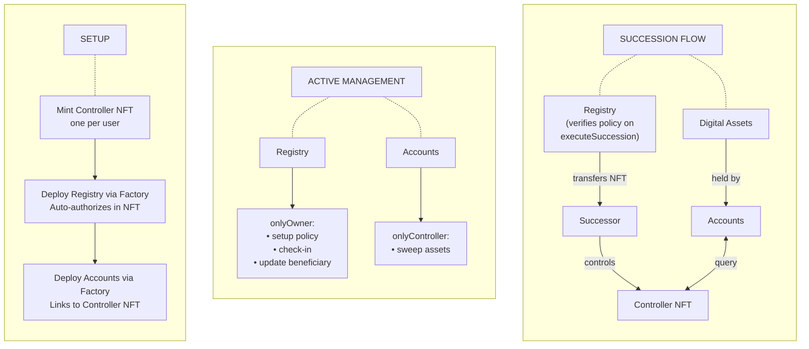

---

### Three-Layer Model

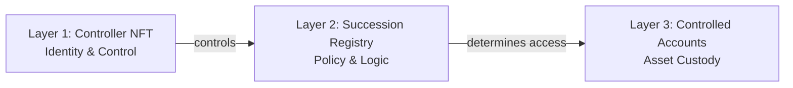

---

## Component Architecture

### Controller NFT - Internal Structure
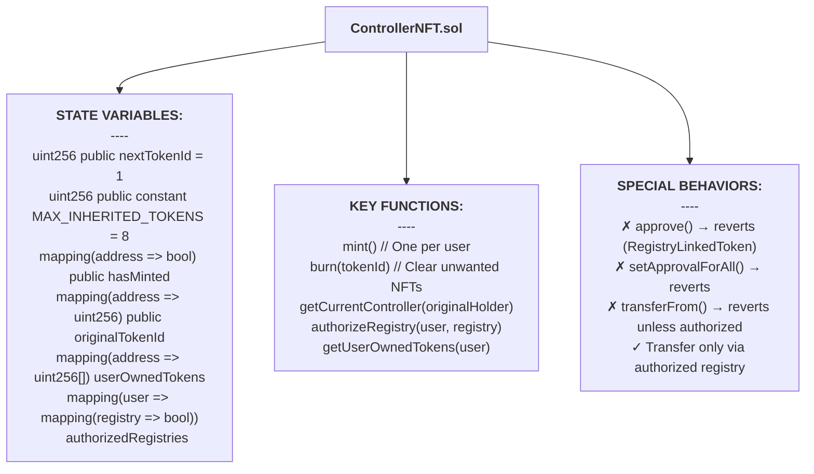

---

### Succession Registry - Internal Structure
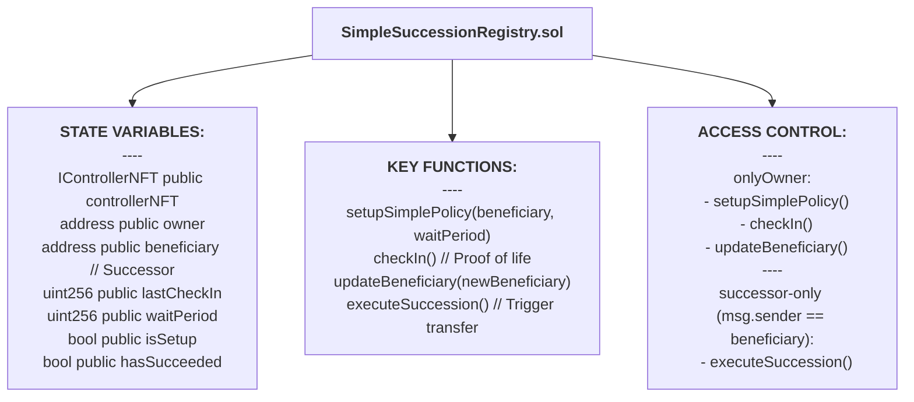

**Important:** SimpleSuccessionRegistry does NOT implement INFTLinked. Registries MANAGE the NFT, they are not CONTROLLED BY it. Only contracts that should automatically recognize succession (like vaults) implement INFTLinked.

**Note on Variable Naming:** The code uses `beneficiary` as the state variable name for the successor's address. This is preserved in code diagrams while explanatory text uses "successor."

---

### NFTLinked Pattern - Implementation Hierarchy
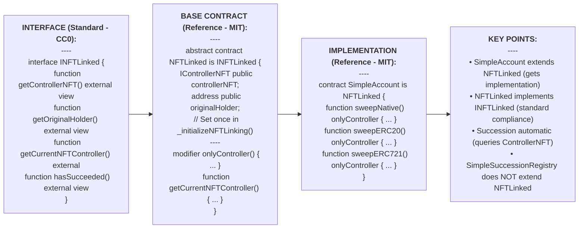

---

### Controlled Account - Internal Structure
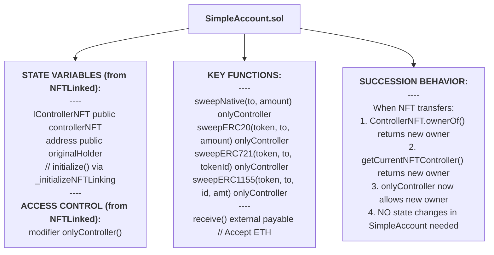

---

### Succession Griefing Protection - Storage Limits
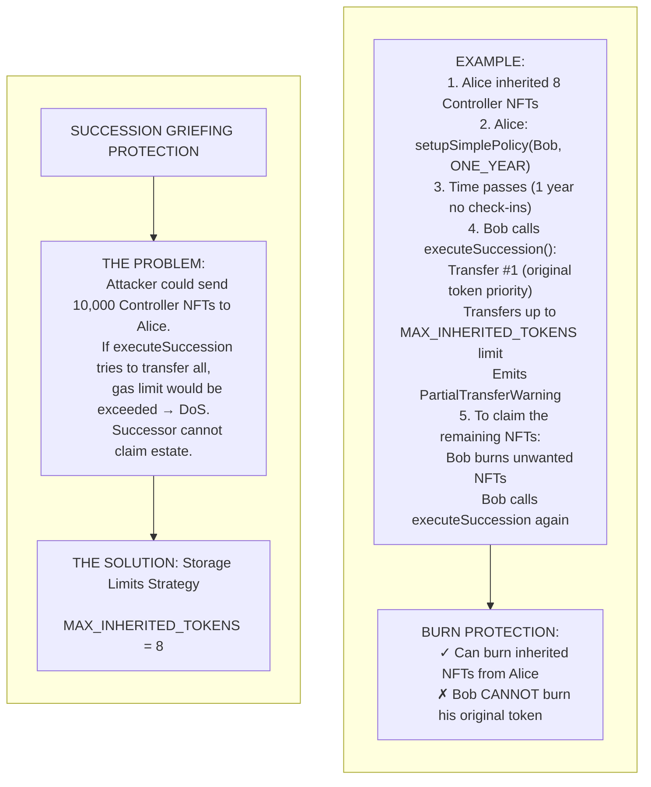

---

## Succession Flows

### Simple Mode: Time-Based Succession Flow

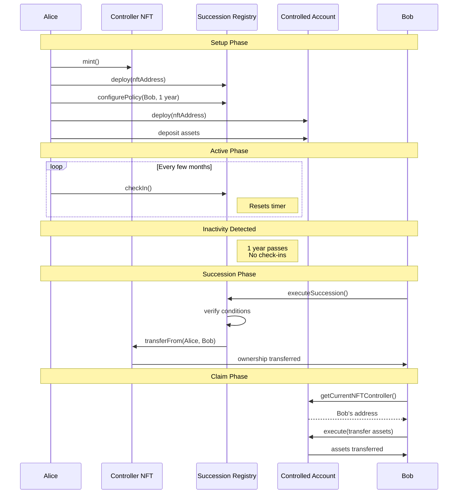

---

### Multi-Generation Succession

**How It Works:**
- Generation 1: Alice sets up succession to Bob
- Bob inherits Alice's NFT after conditions met
- Generation 2: Bob can update the policy or create his own NFT
- Charlie can inherit from Bob using the same pattern
- Each generation maintains the succession chain

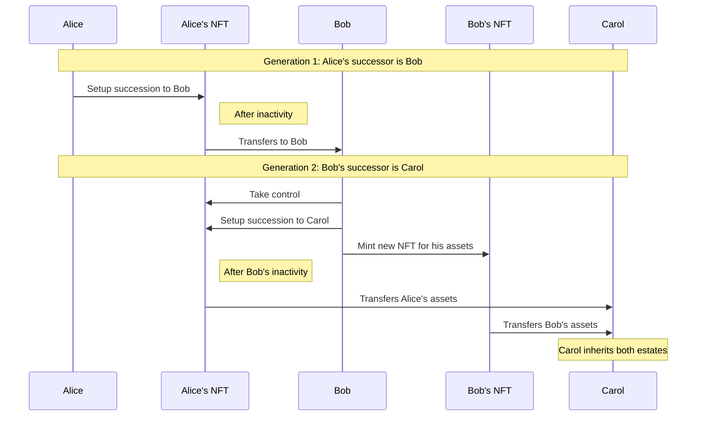

---

## Integration Patterns

### ERC-6551 Token Bound Account Integration

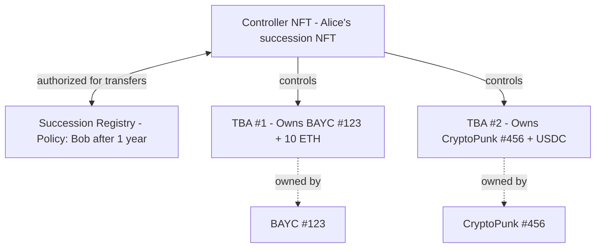

**Succession Flow:**
1. Alice controls Controller NFT which controls TBAs that controls underlying NFTs
2. After 1 year inactivity, Bob executes succession
3. Controller NFT transfers to Bob
4. Bob now controls both TBAs and their underlying NFTs
5. All assets in TBAs automatically recognize Bob

---

### ERC-4626 Trust Integration

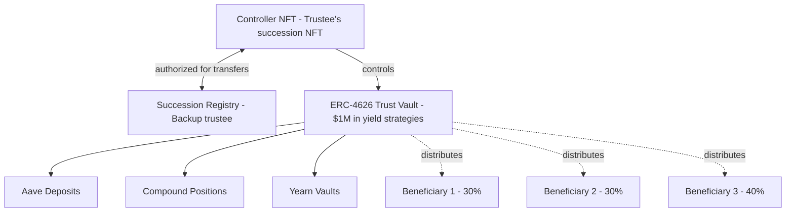

**Trust Scenario:**
- Trustee manages $1M trust for 3 beneficiaries
- If trustee becomes unavailable, backup trustee takes over via succession
- Trust continues operating under new controller
- Beneficiaries' shares remain intact

---

### DeFi Protocol Integration

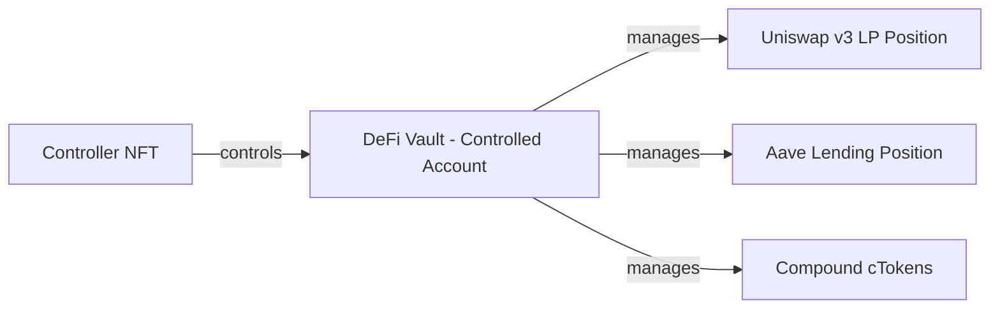

**Key Benefits:**
- Vault holds protocol positions (LP tokens, aTokens, cTokens)
- Positions continue earning yield during lifetime
- Upon succession, new controller claims all positions
- No need to withdraw/redeposit

---

## Security Model

### Trust Boundaries
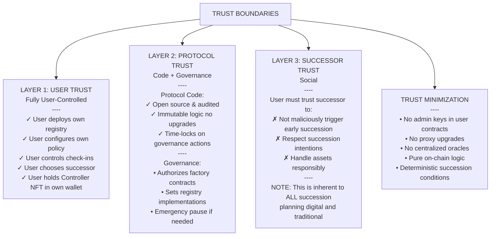

**Trust Model:**
- **Trustless**: Core NFT → Registry → Vault flow
- **Trust Required**: Factory deployers (optional path)
- **Mitigation**: Users can deploy contracts manually without factories

---

### Attack Mitigation Layers

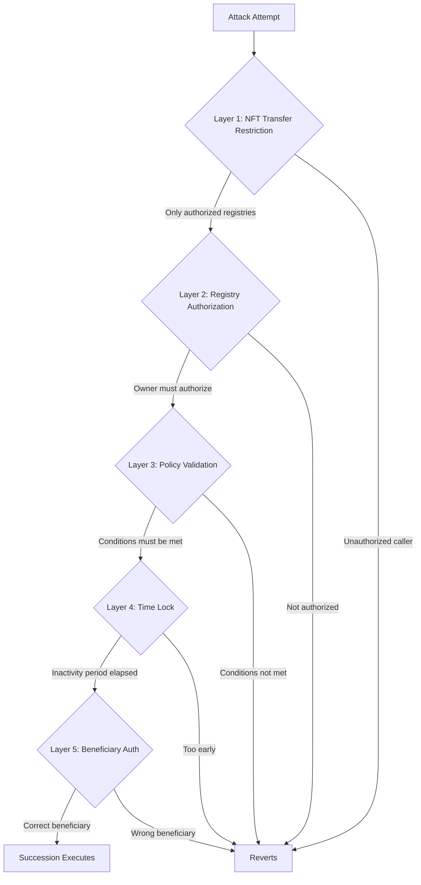

**Defense in Depth:**
1. NFT restricts transfers to authorized registries only
2. Token holder must explicitly authorize each registry
3. Policy conditions must be satisfied
4. Inactivity period prevents instant succession
5. Only designated beneficiary can execute

---

## Deployment Patterns

### Factory Pattern (Recommended)

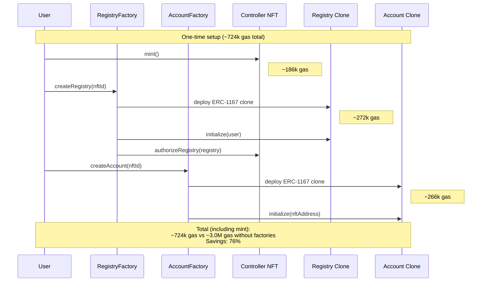

**Gas Comparison:**

| Deployment Method | Registry | Account | Total | Savings |
|-------------------|----------|---------|-------|---------|
| Full Deploy | 1.37M gas | 1.44M gas | 2.81M | - |
| Factory Clone | 272k gas | 266k gas | 538k | 81% |

---

### Multi-Chain Deployment

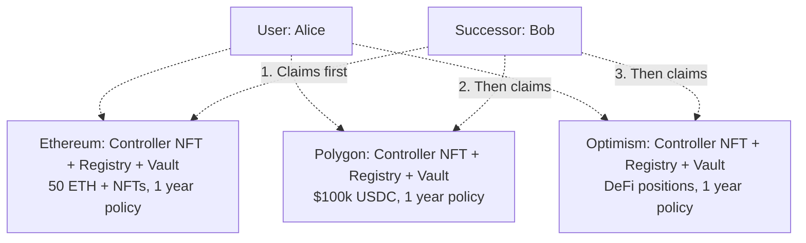

**Multi-Chain Benefits:**
- ✓ Independent succession per chain
- ✓ No bridge risk during lifetime
- ✓ Lower gas costs on L2s
- ✓ Diversified infrastructure risk

**Claiming Strategy:**
1. Bob claims Ethereum estate first (highest value/gas available)
2. Uses ETH to cover gas for other chains
3. Claims Polygon, Optimism, etc.
4. Optionally bridges to preferred chain

---

## Summary

These diagrams illustrate:

**System Architecture**: Three-layer model (Identity, Policy, Custody)  
**Component Internals**: How each contract is structured  
**INFTLinked Pattern**: Interface, base contract, and implementation hierarchy  
**Succession Flows**: Simple Mode (time-based) and multi-generation inheritance  
**Integration Patterns**: ERC-6551, ERC-4626 trusts, DeFi protocols  
**Security Model**: Trust boundaries, factory trust, and attack mitigations  
**Deployment**: Factory pattern and multi-chain strategies  

---

**For Implementation Details:**
- See [IntegrationGuide.md](./IntegrationGuide.md)
- Check [Reference Implementation](../contracts/reference/)
- Review [SecurityConsiderations.md](./SecurityConsiderations.md)

---

**Last Updated:** November 2025