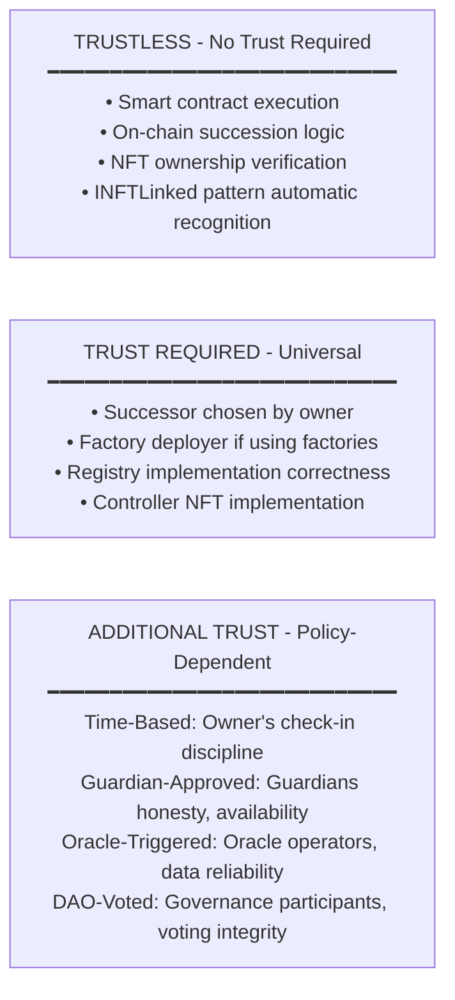

# Security Considerations

> **Status:** Draft - Seeking Community Review  

## Abstract

This document provides security analysis for the Succession-Controlled Accounts standard. It covers threat models, attack vectors, mitigation strategies, and implementation security requirements. The analysis spans three levels: standard interface security (applicable to all implementations), reference implementation security (time-based policies), and guidance for alternative implementations (guardian-approved, oracle-triggered, DAO-voted policies).

Key security properties include succession griefing prevention, key compromise mitigation, and multi-generational succession considerations. This document also addresses operational security and legal considerations.

---

## Standards Compliance

This document follows [EIP-1](https://eips.ethereum.org/EIPS/eip-1) requirements for security considerations.

**Keywords:**
The key words "MUST", "MUST NOT", "REQUIRED", "SHALL", "SHALL NOT", "SHOULD", "SHOULD NOT", "RECOMMENDED", "MAY", and "OPTIONAL" in this document are to be interpreted as described in [RFC 2119](https://www.ietf.org/rfc/rfc2119.txt).

---

**Terminology Note:** This document uses "successor" to describe the person designated to gain control after succession conditions are met. The reference implementation code uses `beneficiary` as the variable name for this address. These terms refer to the same concept.

---

## Table of Contents

- [Document Scope](#document-scope)
- [Threat Model](#threat-model)
- [Standard-Level Security](#standard-level-security)
- [Reference Implementation Security](#reference-implementation-security)
- [Alternative Implementation Guidance](#alternative-implementation-guidance)
- [Smart Contract Security](#smart-contract-security)
- [Operational Security](#operational-security)
- [Economic Security](#economic-security)
- [Privacy Considerations](#privacy-considerations)
- [Security Best Practices](#security-best-practices)
- [Legal and Regulatory Considerations](#legal-and-regulatory-considerations)
- [Formal Verification](#formal-verification)
- [Conclusion](#conclusion)
- [Security Discussions](#security-discussions)

---

## Document Scope

This document covers security considerations at three levels:

**1. Standard-Level Security** applies to ALL Implementations. It includes core interface security properties, trust model requirements, and attack vectors inherent to the pattern.

**2. Reference Implementation Security** applies to the time-based policy. It covers the specifics, including factory trust, the storage limits strategy with MAX_INHERITED_TOKENS = 8, and mitigations.

**3. Alternative Implementation Guidance** applies to guardian-approved policies, oracle-triggered policies, DAO-voted policies, and custom registry patterns.

---

## Threat Model

### Threat Actors

**1. The Owner (NFT Holder)** mints the Controller NFT and sets up a succession policy.
- **Threats:** Key compromise, coercion, death

**2. The Successor** is the designated person who will gain control when succession conditions are met.
- **Threats:** Impatient successor, malicious actor

**3. Policy-Specific Actors** in alternative ISuccessionRegistry implementations.
- **Guardian Threats**: Collusion, compromise, availability
- **Oracle Threats**: Manipulation, downtime, false reports, privacy
- **Governance Threats**: Vote manipulation, governance attacks
- **Executor Threats**: Unauthorized execution, executor compromise

**Note:** The reference implementation uses time-based policies with no additional actors beyond owner and successor.

**4. External Attackers** want to steal assets or disrupt succession by compromising keys, contracts, oracles, or governance
- **Threats:** Standard Web3 attack vectors

### Assets at Risk

Native and tokenized assets: ETH, ERC20/721/1155 tokens, and DeFi positions.

### Trust Boundaries


---

## Standard-Level Security

This section covers security considerations applicable to ALL implementations of the standard.

### 1. Succession Griefing

An attacker fills a successor's token capacity before a legitimate succession occurs. By controlling NFTs that designate the same successor and triggering succession first, the successor is caught at or near MAX_INHERITED_TOKENS capacity when they attempt to claim a legitimate succession.

The reference implementation mitigates this through:
- Pull pattern: only the successor can call `executeSuccession()`
- Storage limits: `MAX_INHERITED_TOKENS = 8`
- Partial transfer support
- Burn function for spam removal  
- Original token burn protection

**Implementations MUST prevent unbounded token accumulation to avoid succession griefing attacks.**

#### Storage Limits Strategy

The reference implementation uses `MAX_INHERITED_TOKENS = 8` based on gas analysis and practical use cases.

**Gas Analysis (Inheritance Griefing Protection):**

The `MAX_INHERITED_TOKENS = 8` limit ensures succession remains executable even under adversarial conditions. Gas costs measured for a worst-case scenario:

Transfer Count | Gas Cost      | Block Limit % | Measurement Type
---------------|---------------|---------------|------------------
1 token        | 123k gas      | 0.41%         | Max (worst-case)
2 tokens       | 167k gas      | 0.56%         | Max (worst-case)
8 tokens (max) | 442k gas      | 1.47%         | Max (worst-case)

The design supports 3-4 generation inheritance chains, covering typical scenarios. Worst-case gas remains under 2% of the block limit (30M gas),

*Gas measurements represent maximum (worst-case) values from `forge test --gas-report` on reference implementation. Worst-case assumes successor starts with 0 tokens and receives maximum tokens in single succession.*

**Alternative implementations MAY use different limits based on their threat model. They SHOULD document their chosen limit and rationale, and MUST enforce some upper bound to prevent griefing.**

**User Recovery Path:**

If griefed, a successor can:
1. Burn unwanted/spam tokens
2. Retry succession after clearing space

**Note:** It is recommended that users consolidate assets from inherited accounts and subsquently burn inherited Controller NFTs to reduce storage required for their own succession.

---

### 2. Private Key Compromise

The private key is compromised for a wallet holding Controller NFT. The attacker gains control of all linked accounts in addition to the succession registry `onlyOwner` functions.

**Attack Scenario:**
```
1. Attacker compromises Alice's wallet
2. Attacker gains Controller NFT and can checkIn() and updateBeneficiary() in registry
3. Attacker can still control all INFTLinked accounts via `getCurrentNFTController()`
```

Mitigations include:
- Store Controller NFT in hardware wallets
- Mint Controller NFT from a multi-sig (M-of-N protecting Alice)
- Use alternative implementation policies for high-value succession scenarios (not in reference)

---

### 3. Unclaimed Succession and Chained Failure

A successor dies without claiming a succession assigned to them as beneficiary. The next-generation cannot access the unclaimed estate.

**Scenario:**
```
Alice - Bob (son) - Charlie (grandson)

1. Alice becomes inactive (1 year waitPeriod policy)
2. Bob delays on claiming
3. Bob becomes inactive (1 year waitPeriod policy)  
4. Charlie claims Bob's estate
5. Alice's estate remains unclaimed
```

**Implementations MUST clearly document their succession claim authorization model.**

The reference implementation restricts `executeSuccession()` to the designated successor only (`msg.sender == policy.beneficiary`). This protects successors from unwanted tax liabilities, exposure to blacklisted or sanctioned assets, forced involvement in litigation, or responsibility for unknown liabilities.

Alternative implementations MAY implement contingent successors, permissionless claiming after an extended period, or claim delegation:

**Contingent Successors**
```solidity
struct Policy {
    address primaryBeneficiary;
    address contingentBeneficiary;
    uint256 gracePeriod;
}
```

**Permissionless After Extended Period**
```solidity
function executeSuccession() external {
    uint256 elapsed = block.timestamp - lastCheckIn;
    if (elapsed < waitPeriod * 2) {
        require(msg.sender == policy.beneficiary);
    }
    // After 2x period anyone can trigger
}
```

**Claim Right Delegation**
```solidity
mapping(address => address) public claimDelegates;
```

Users SHOULD claim promptly, or decline explicitly, and document succession setup in traditional estate planning with parallel legal structures for multi-generational scenarios and contingency plans for unclaimed estates.

---

### 4. Registry Implementation Bugs

A malicious or buggy registry implementation locks succession or enables unauthorized transfers.

**Mitigations:**
1. Registry authorization: Only a registries authorized by NFT holder can transfer NFT
    ```solidity
    mapping(address => mapping(address => bool)) public authorizedRegistries;

    function isAuthorizedRegistry(address user, address registry) external view returns (bool);
    ```
2. Trusted factory pattern: Only trusted factories can auto-authorize registries
    ```solidity
    mapping(address => bool) public isTrustedFactory;

    function setTrustedFactory(address factory, bool trusted) external onlyOwner;
    ```

3. Factory enforces one registry per user: Prevents race conditions between multiple registries
    ```solidity
    if (_userRegistry[msg.sender] != address(0)) revert RegistryAlreadyExists();
    ```

4. Factory ownership: Factory should be owned by governance/multisig
    ```solidity
    constructor() Ownable(msg.sender) {
        // Transfer ownership to multisig after deployment
    }
    ```

**Recommended Deployment Flow:**
```
// All contracts SHOULD be thoroughly audited
1. Deploy Controller NFT
2. Deploy implementation contracts
3. Deploy factories pointing to implementations
4. Set factory as trusted in Controller NFT (onlyOwner)
5. Transfer Controller NFT ownership to governance/multisig
6. Users create registries via trusted factory
```

**Implementations SHOULD include multiple independent audits, formal verification of critical functions, a bug bounty program, and emergency pause functionality before production use. With proper audits and governance, the residual risk is low.**

---

### 5. Accidental Asset Loss

Users accidentally send assets to infrastructure contracts instead of vaults.

**Scenario:**
```
1. User sends 10 ETH to ControllerNFT address
2. ControllerNFT has no recovery function
3. ETH permanently lost
```

**Mitigations:**
- ONLY Controlled Accounts should hold assets
- Controller NFT, registries, and factories are infrastructure only
- Clear documentation 
- UI/UX protection

**Comparison:**
- Sending ETH to ERC20 contract = user error, not recoverable
- Sending NFT to wrong address = user error, not recoverable
- **The same principle applies here**

---

### 6. Registry Authorization Permanence

A registry is compromised or user made a mistake during policy setup. 

Implementations have flexibility for design choices:

1. Permanent Authorization (Reference Implementation): Registry authorization is permanent once set. The Registry Factory auto-authorizes the registry clone upon initialization, which can only happen once. Users should carefully choose their succession policy conditions. Changes to the succession policy are limited to `updateBeneficiary()`. To modify the `waitPeriod` users must start fresh from a new address: 
    ```
    1. Mint a new Controller NFT
    2. Deploy new registry
    3. Set up new succession policy
    4. Sweep assets into new accounts
    ```
    Any NFTLinked accounts for the old Controller NFT would need to be consolidated under the new Controller NFT controlled-accounts to honor the new succession policy.

2. Revocable Authorization (Alternative Implementations): Users can revoke and re-authorize registries to enable policy changes without starting over. MUST implement DoS protections.

3. Upgradeable Registries (Alternative Implementations): A registry contract that supports policy upgrades would not require revocation and re-authorization.

**Implementations SHOULD document their authorization model clearly.**

This standard does NOT require authorization revocation mechanisms. 

---

### 7. Cross-Chain Replay Attacks

A succession signature or state replay across different chains.

**Scenario:**
- User deploys same succession setup on multiple chains
- Attacker captures transaction data from one chain
- Attacker replays on another chain

**Implementations that support multi-chain deployment MUST include chain ID in all signed messages, use chain-specific nonces or salts, and document cross-chain replay protection.**

The reference implementation uses direct function calls (no signatures) and is inherently chain-specific.

---

### 8. Beneficiary Address Risks

**Sanctioned Addresses:** If beneficiary address becomes sanctioned (OFAC, EU sanctions) after policy setup but before succession, technical succession may succeed but legal compliance may prohibit claiming, potentially freezing assets. 

**Compromised Addresses:**  If the beneficiary private key is compromised before succession executes, the attacker gains succession authority with no technical recourse after NFT transfer.

Users SHOULD:
- Monitor beneficiary address status
- Update beneficiary if address becomes problematic
- Consider multi-sig beneficiaries for high-value estates
- Maintain legal documentation independent of addresses

---

### 9. Long-Term Cryptographic Risks

ECDSA signatures may become vulnerable to quantum computing attacks.

**Considerations for Long-Term Succession:** Current cryptography may not remain secure for multi-decade succession plans. Ethereum may migrate to post-quantum cryptography, and users may need migration paths to quantum-resistant schemes.

**Implementations SHOULD document the expected cryptographic lifetime, migration strategies if underlying cryptography becomes insecure, and upgrade paths for long-term succession scenarios.**

The reference implementation 

---

### 10. Contract Self-Destruction

A Controlled Account calls SELFDESTRUCT, creating problems. 

**Implementations of IControlledAccount SHOULD NOT include SELFDESTRUCT functionality.**

The reference implementation does not implement `SELFDESTRUCT`. Users can withdraw all SimpleAccount assets via sweep functions before abandoning contracts.

---

## Reference Implementation Security

This section covers security specific to the time-based reference implementation.

### 1. Factory Trust Model

Users deploy registries via factories (required for registry auto-authorization), creating specific trust requirements:

**Factory Trust Requirements:**

- Factory deployer (ownership and access control)
- Factory implementation (correct registry deployment)
- Registry implementation (succession logic correctness)

**Implementations that use factory-only authorization MUST implement dual verification checking both factory tracking and ownership, document the factory governance model, and clearly communicate trust assumptions. With proper governance and audits, residual risk is low.**

The reference implementation uses single-owner control for testing and demonstration purposes. ControllerNFT deployer initially owns the ControllerNFT contract and controls which factories are trusted. In the ControllerNFT contract it restricts `authorizeRegistry()` to only trusted factories by checking `isTrustedFactory[msg.sender]`. `authorizeRegistry()` also verifies the registry clone (Ownable) being authorized is owned by the ControllerNFT holder deploying the registry. Users cannot call this function directly.

Alternative implementations MAY allow users to call `authorizeRegistry()` directly to enable trustless manual deployment. This would check that the caller owns the original token and that they own the registry contract being authorized.
```solidity
function authorizeRegistry(address registry) external {
    require(msg.sender == ownerOf(originalTokenId[msg.sender]));
    require(Ownable(registry).owner() == msg.sender);
    authorizedRegistries[msg.sender][registry] = true;
}
```

---

### 2. Reentrancy Attacks

A malicious successor triggers reentrancy during succession transfer.

**Scenario:**
```
1. Successor implements malicious onERC721Received
2. During succession transfer, calls back into registry
3. Attempts to re-execute succession or manipulate state
```

An attack contract might implement onERC721Received to attempt reentrancy by calling back to executeSuccession, but the nonReentrant guard prevents this.

**Mitigations include:**
- ReentrancyGuard on all state changing functions
- Registry is infrastructure contract (holds no valuable assets)

---

### 3. Front-Running Initialization

An attacker front-runs clone initialization to gain control.

**Scenario:**
```
1. Factory deploys clone for Alice
2. Attacker sees transaction in mempool
3. Attacker front-runs with initialize(attacker, ...)
4. Attacker now controls Alice's registry/account
```

**Mitigations:**
1. Factory-Only Initialization
    ```solidity
    function initialize(address owner, address nft, address factory) external initializer {
        if (msg.sender != _factory) revert NotFactory();
        // ... initialize
    }
    ```

2. Cross-Verification in NFT
    ```solidity
    function authorizeRegistry(address user, address registry) external {
        if (!_isTrustedFactory[msg.sender]) revert NotTrustedFactory();

        // Verify factory tracks this registry for this user
        address trackedRegistry = IRegistryFactory(msg.sender).userRegistry(user);
        if (trackedRegistry != registry) revert NotAuthorized();

        // Verify user owns the registry
        address registryOwner = Ownable(registry).owner();
        if (registryOwner != user) revert NotAuthorized();
        // ...
    }
    ```

3. Atomic Deployment + Initialization
    ```solidity
    function createRegistry() external nonReentrant returns (address registry) {
        // Verification guards
        // Deploy clone
        registry = registryImplementation.clone();
        
        // Initialize immediately (same transaction)
        SimpleSuccessionRegistry(registry).initialize(
            msg.sender,
            controllerNFT,
            address(this)
        );
        
        // Auto-authorize
        IControllerNFT(controllerNFT).authorizeRegistry(msg.sender, registry);
    }
    ```

4. Initializer Modifier Protection
    ```solidity
    function initialize(...) external initializer {
        // Can only be called once
        // _disableInitializers() in constructor prevents implementation init
    }
    ```

---

### 4. Time Manipulation

A miner/validator manipulates block.timestamp is brinbed by a successor that wants to claim early, bypassing the wait period.

**Constraints:** Ethereum consensus rules. The block.timestamp must be greater than parent.timestamp, close to real time (±15 seconds), and validators cannot set arbitrary timestamps.

**Mitigations:**
1. Reasonable Wait Periods: Longer periods make manipulation window negligible
uint256 SIX_MONTHS = 180 days; 
uint256 ONE_YEAR = 365 days;    

A one hour wait period, on the other hand, could be manipulated by ~15 seconds. Minimum check-in intervals of 7 days prevent timestamp abuse via check-in spam.

**Real-World Impact:**
- Miner can manipulate by ~15 seconds to minutes
- Not economically viable for most estates

An alternative is to use block numbers intead of timestamps.

---

### 5. Burning Originally Minted Tokens

Users can burn their originally minted NFT to permanently lock assets and block succession.

**Scenario:**
1. Alice mints Controller NFT (original token)
2. Alice burns token to prevent succession
3. `getCurrentController()` returns `address(0)` (all accounts become inaccessible)

**Reference Implementation Protection:** Users cannot burn originally minted Controller NFT
```solidity
// ControllerNFT.sol
    function burn(uint256 tokenId) external {
        if (_ownerOf(tokenId) != msg.sender) revert NotAuthorized();
        if (_originalTokenId[msg.sender] == tokenId) revert CannotBurnOriginalToken();

        _burn(tokenId);
        emit ControllerNFTBurned(msg.sender, tokenId);
    }
```

All INFTLinked accounts query this token via originalHolder, and burning it breaks the entire succession structure.

**User Guidance:**
- To exit the system: Sweep Controlled Accounts or transfer to successor/self, don't burn
- To consolidate: Transfer assets, then burn inherited tokens
- If registry is compromised: Sweep assets to new wallet, abandon succession structure, start fresh

---

## Alternative Implementation Guidance

This section provides security guidance for implementations using guardians, oracles, or DAO voting.

### Oracle Manipulation

An attacker manipulates oracle data for custom registries using oracles.

**Scenario (Hypothetical):** Custom registry with health oracle
1. Registry checks health oracle for proof of hospitalization
2. Attacker compromises oracle
3. Oracle reports false hospitalization
4. Succession triggers prematurely

**Mitigations:** Always requiring minimum wait period, guardian override if oracle fails, consensus from multiple decentralized oracles, and owner override by checking in.

---

## Smart Contract Security

### Initialization Security

The implementation contract needs protection from being initialized.

**Mitigations:** 

1. Implementation Protection: Disable initializers in the implementation:
    ```solidity
    constructor() {
        _disableInitializers();
    }
    ```

2. Clone Initialization Protection: only the factory can initialize, zero address checks, prevent re-initialization:
    ```solidity
    function initialize(address _owner, address _controllerNFT, address _factory) external initializer {
        if (_owner == address(0) || _controllerNFT == address(0)) revert ZeroAddress();
        if (msg.sender != _factory) revert NotFactory();
        
        __Ownable_init(owner);
        __ReentrancyGuard_init();
        
        controllerNFT = ControllerNFT(_controllerNFT);
    }
    ```

---

### Access Control

Controller NFT transfers use the RegistryLinkedToken pattern, blocking all standard ERC-721 transfer methods. The `approve` and `setApprovalForAll` functions revert with `RegistryLinkedToken`. The `_update` function enforces that only authorized registries can transfer tokens by checking the `authorizedRegistries` mapping.

**Controller NFT Transfers:**
```solidity
function approve(address, uint256) public pure override {
    revert RegistryLinkedToken();
}

function setApprovalForAll(address, bool) public pure override {
    revert RegistryLinkedToken();
}

// Defensive control catches all edge case transfers
function _isAuthorized(...) internal view override returns (bool) {
    return authorizedRegistries[owner][spender];
}

// Only authorized registries can transfer
function _update(address to, uint256 tokenId, address auth) internal override {
    from = _ownerOf(tokenId);
    if (from != address(0) && to != address(0)) {
        if (!authorizedRegistries[from][auth]) revert RegistryLinkedToken();
    }
    return super._update(to, tokenId, auth);
}
```

Account access control uses NFT-based control with automatic succession.

**Account Access Control:**
```solidity
// NFT-based access control (automatic succession)
modifier onlyController() {
    address controller = getCurrentNFTController();
    if (controller == address(0) || msg.sender != controller) revert NotNFTController();
    _;
}

function getCurrentNFTController() public view returns (address) {
    return controllerNFT.getCurrentController(originalHolder);
}
```

---

### Upgrade Safety

The implementations are NOT upgradeable. Users deploy their own clones, which decentralizes control. No proxy admin can change logic.

**Upgrade Path:** Deploy a new implementation, deploy a new factory pointing to it, and users voluntarily migrate by creating new clones. This approach has no centralized upgrade authority so users maintain control without surprise changes, while allowing gradual migrations. The risks are that you cannot fix bugs in deployed clones and users must manually migrate.

---

### Input Validation

Constructor validation checks for factories enforce implementation and controllerNFT addresses are not zero.

1. Factory Constructor Validation
    ```solidity
    constructor(address _implementation, address _controllerNFT) {
        if (_implementation == address(0)) revert ZeroAddress();
        if (_controllerNFT == address(0)) revert ZeroAddress();
        // ...
    }
    ```

Registry validation checks enforce policies are configured and beneficiaries are not zero addresses.

2. Function Parameter Validation:
    ```solidity
    function setupSimplePolicy(address beneficiary, SimpleWaitPeriod waitPeriod) external onlyOwner {
        if (policy.configured) revert AlreadyConfigured();
        if (beneficiary == address(0)) revert ZeroAddress();
        // ...
    }

    function updateBeneficiary(address newBeneficiary) external onlyOwner {
        if (!policy.configured) revert NotConfigured();
        if (newBeneficiary == address(0)) revert ZeroAddress();
        // ...
    }
    ```

---

### Integer Overflow/Underflow

Solidity 0.8.x has built-in overflow and underflow protection. All arithmetic operations are automatically checked, so calculating elapsed time or available capacity for `MAX_INHERITED_TOKENS` cannot underflow.

1. Solidity 0.8.x Protection:
    ```solidity
    pragma solidity ^0.8.20;

    uint256 elapsed = block.timestamp - lastCheckIn; // Cannot underflow
    uint256 available = maxTokens - currentTokens;   // Cannot underflow
    ```

Calculating `daysUntilClaimable` checks if elapsed time exceeds the wait period and returns 0, otherwise performing safe division.

2. Safe Math Operations:
    ```solidity
    function getWaitPeriod() internal view returns (uint256) {
        return policy.simpleWait == SimpleWaitPeriod.SIX_MONTHS 
            ? 180 days 
            : 365 days;
    }

    function calculateDaysUntilClaimable() public view returns (uint256) {
        uint256 waitPeriod = getWaitPeriod();
        uint256 elapsed = block.timestamp - lastCheckIn;
        
        if (elapsed >= waitPeriod) {
            return 0;
        }
        
        return (waitPeriod - elapsed) / 1 days; // Safe division
    }
    ```

---

## Operational Security

### Key Management

1. The Controller NFT owner:
- Most secure setup: 
    - Hardware wallet or Multi-sig
    - Multi-location backups
- Only connecting for check-ins and active vault management

2. The Successor:
- Same secure setup as owner
- Only connecting for claiming
- After inheriting:
    - Immediately consolidate assets to their own accounts
    - Burn the inherited NFT to respect storage limits
    - Set up their own succession policy (they are now owner)

3. Guardians 
- Secure wallets
- Provide approval signatures
- No direct asset access

---

**Key Backup Strategy:**

1. Split seed phrase using Shamir Secret Sharing (2-of-3 threshold):
   - Location 1: Home safe
   - Location 2: Bank vault  
   - Location 3: Trusted family member
2. Metal backup

**Important:** The owner's private keys should NEVER be shared. Succession occurs through the smart contract transferring the Controller NFT, not through key sharing.

---

### Multi-Chain Considerations

Deploying registries on multiple chains creates independent succession states. Check-ins on one chain do not propagate to others.

**Mitigations:**
- Document check-in requirements for all chains
- Use automation/reminders for multi-chain check-ins
- Consider deploying on a single chain for simplicity

---

## Economic Security

### Gas Economics

**Gas Cost Analysis:**

Setup (one-time):
```
Operation          | Gas Cost  | Notes
-------------------|-----------|---------------------------
Mint NFT           | ~186k gas | Per user, one-time
Create Registry    | ~272k gas | EIP-1167 clone
Create Account     | ~266k gas | EIP-1167 clone
Total Setup        | ~724k gas | Compared to ~3.0M without factories
```

Ongoing Operations:
```
Operation          | Gas Cost  | Notes
-------------------|-----------|---------------------------
Check-in           | ~9k gas   | Periodic activity proof
Execute Succession | ~123k gas | Single NFT transfer (worst-case)
Sweep Native       | ~29k gas  | Per withdrawal
Sweep ERC20        | ~54k gas  | Per token per withdrawal
Sweep ERC721       | ~30k gas  | Per NFT per withdrawal
```

**Note:** Gas costs from actual test execution. Execute Succession represents worst-case measurement (successor with 0 tokens, cold storage initialization). Other operations represent typical usage patterns (median). Actual costs vary based on state and network conditions.

See `docs/gas-report.txt` for complete test data and methodology.

**Factory Deployment Savings:**
- Registry: 80.1% savings (272k vs 1.37M)
- Account: 81.5% savings (266k vs 1.44M)

**MEV Considerations:**
- Only designated successor can claim (`msg.sender == beneficiary`)
- Front-running provides no advantage

---

### Economic Incentives

**Cryptoeconomic Analysis:**

**Owner Incentives:** The owner maintains control while active through check-ins that prove activity. They protect assets with minimal ongoing costs and can update the beneficiary as circumstances change.

**Successor Incentives:**  The successor gains control of assets after succession (positive incentive) but cannot claim until conditions are met (time-lock protection). They may choose not to claim for tax planning or liability avoidance and must pay gas costs to execute succession.

**Attacker Incentives:** Cannot steal NFT without key compromise since transfers are restricted. Sensitive actions in registry and account clones are mitigated by access control. Griefing attacks are mitigated by protection mechanisms. Front-running provides no benefit since claims don't expire. Social engineering remains possible but applies to all crypto.

**Policy-Specific Incentives:**

1. Time-Based (Reference Implementation): Require minimal coordination between only owner and successor, no third parties.

2. Guardian-Approved (Alternative Implementations): Require coordination among guardians, use a trust model, and require multiple compromises for collusion.

3. Oracle-Triggered (Alternative Implementations): Depend on oracle reliability incentives, may introduce manipulation vectors, and require robust oracle design.

4. DAO-Voted (Alternative Implementations): Use collective decision-making, require governance participation, and face vulnerability to governance attacks

**Note:** Incentives can vary significantly by:
- Jurisdiction (tax treatment)
- Asset types (sanctioned assets)
- Family dynamics (adversarial relationships)
- Regulatory environment (compliance requirements)

**Implementations SHOULD NOT assume benevolent actors in security design.**

---

## Privacy Considerations

### On-Chain Privacy

**What's Public:** Controller NFT ownership, registry address and policy, beneficiary address, account addresses, guardian/oracle/DAO addresses for alternative implementations, check-in timestamps, and succession transfer events.

**What's Private:** Beneficiary identity if using an anonymous address, and the real-world relationship to the beneficiary or guardians (for alternative implementations).

---

## Security Best Practices

### For Users

**1. Setup Phase:**
- Use hardware wallet for Controller NFT
- Choose trusted beneficiary carefully
- Use guardian-approved policies for high-value scenarios (if implemented)
- Select distributed guardians (if implemented)
- Test with small amounts first
- Document setup for beneficiary (off-chain)

**2. Operational Phase:**
- Check in regularly (quarterly recommended)
- Set calendar reminders
- Monitor for unusual activity
- Keep beneficiary informed (in case you're incapacitated)
- Review and update beneficiary as needed
- Monitor guardian availability (if implemented)

**3. Asset Management:**
- Only send assets to Controlled Accounts, never to infrastructure
- Diversify across multiple vaults if desired
- Use L2s for lower gas costs
- Keep small ETH balance in beneficiary wallet for gas
- Document vault addresses for beneficiary

---

### For Integrators

**1. Integration Security:**
- Always verify user has Controller NFT before allowing actions
- Always use getCurrentController() for access control
- Listen for SuccessionExecuted events to update UI
- Handle succession state changes gracefully
- Show clear warnings for infrastructure addresses vs vaults

**2. Testing:**
- Test all revert conditions
- Test with malicious receivers (reentrancy attempts)
- Test succession edge cases (unwanted tokens, capacity limits)
- Test time-based conditions
- Fuzz test with random inputs
- Integration tests for multi-component workflows

**3. Deployment:**
- Audit implementations thoroughly
- Use trusted factories only
- Implement emergency pause if needed
- Transfer factory ownership to governance
- Document deployment addresses
- Verify contracts on explorers

---

### For Protocol Developers

**1. Custom Implementations:**
- Follow standard interfaces (ISuccessionRegistry, IControlledAccount)
- Inherit from NFTLinked for automatic succession
- Use ReentrancyGuard on state changes
- Validate all inputs (zero addresses, bounds checks)
- Emit events for all state changes
- Write comprehensive tests

**2. Advanced Features:**
- If using oracles, require time failsafe
- If using multi-sig for beneficiary, test coordination
- If using custom logic, audit thoroughly
- Document deviations from standard
- Provide migration path from standard implementation

---

## Legal and Regulatory Considerations

**Scope:** This section provides awareness of legal considerations. Users MUST consult qualified legal professionals in relevant jurisdictions.

### Enforceability

Smart contract execution does not guarantee legal recognition of asset ownership transfer. Technical transfer of digital asset control may not be recognized in:
- Probate courts
- Corporate governance proceedings  
- Bankruptcy proceedings
- Regulatory enforcement actions

**User Responsibility:** Establish parallel legal documentation (wills, trusts, operating agreements) in accordance with applicable law.

---

### Jurisdictional Variance

Estate planning, inheritance, and corporate governance laws vary significantly across jurisdictions. Cross-border succession may face legal obstacles.

**User Responsibility:** Consult legal professionals in all relevant jurisdictions where assets are located, parties are domiciled, and execution may occur.

---

### Regulatory Compliance

Digital asset succession may be subject to:
- Securities laws
- Tax regulations
- Anti-money laundering requirements
- Sanctions compliance
- Other regulatory obligations

**User Responsibility:** Understand and comply with applicable regulatory requirements. Maintain audit trails for compliance purposes.

---

### Tax Implications

Asset succession may trigger taxable events including:
- Estate taxes
- Inheritance taxes
- Gift taxes
- Capital gains taxes
- Income taxes

**User Responsibility:** Consult qualified tax advisors regarding tax planning strategies, reporting obligations, liquidity planning for tax obligations, and cost basis documentation.

---

### Dispute Resolution

Smart contracts cannot prevent or resolve:
- Challenges to succession plans
- Disputes among beneficiaries
- Claims by creditors or tax authorities
- Regulatory enforcement actions
- Fraud or undue influence allegations

**User Responsibility:** Maintain comprehensive legal documentation. Consider mediation or arbitration provisions where legally valid.

---

**Standard Disclaimer:**

This standard provides technical infrastructure only. Users MUST:
- Consult qualified legal professionals
- Maintain traditional legal documentation
- Understand tax implications
- Comply with applicable regulations
- Document intentions in legally recognized formats

The technical ability to transfer digital asset control does not guarantee legal recognition, regulatory compliance, or tax efficiency.

---

## Formal Verification

TBD. Seeking feedback.

---

## Conclusion

Succession-Controlled Accounts provide strong security guarantees through:

- **Multiple Defense Layers:** Time-locks + storage limits + check-ins
- **Battle-Tested Patterns:** ReentrancyGuard, Initializable, EIP-1167
- **Trustless Execution:** Smart contracts, no intermediaries
- **Flexible Security:** Simple or Alternative Implementations (based on needs)
- **Transparent Operations:** All actions on-chain and auditable

**Residual Risks include smart contract risk, key management risk, and beneficiary trust**

---

## Security Discussions

Security considerations and vulnerability reports should be discussed through:

- **GitHub Issues:** [Security label](https://github.com/perdura/succession-controlled-accounts/labels/security)
- **Ethereum Magicians:** [EIP Discussion Thread](link-when-available)
- **EIP Repository:** Comments on EIP pull request

For responsible disclosure of critical vulnerabilities in deployed implementations, follow standard Ethereum security disclosure practices.

---

**Last Updated:** November 2025