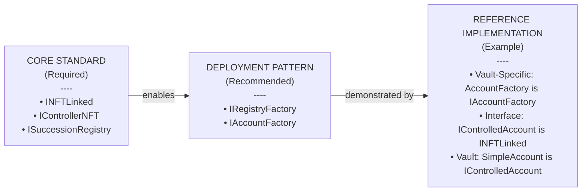
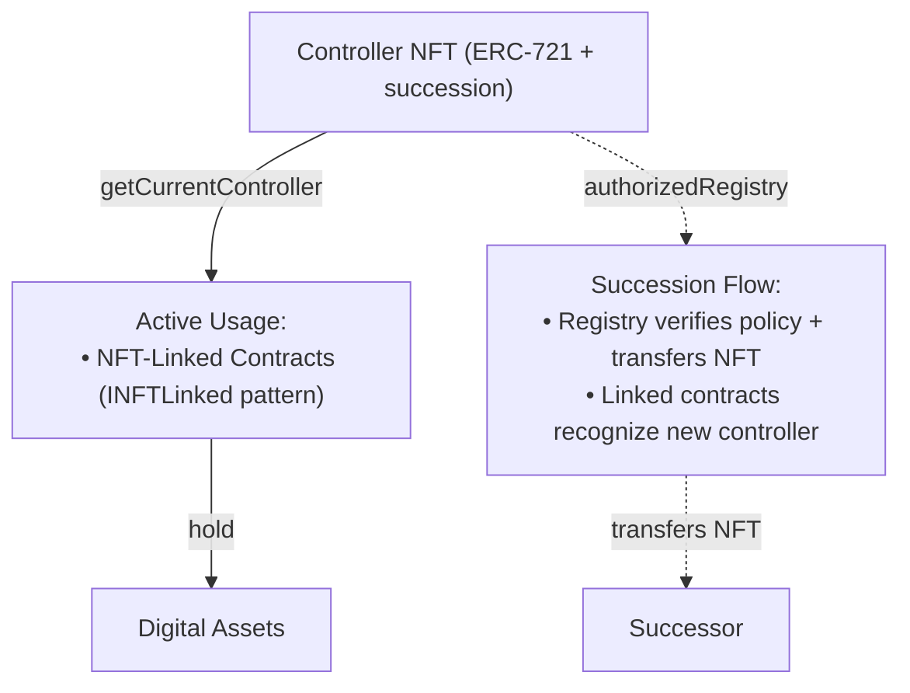
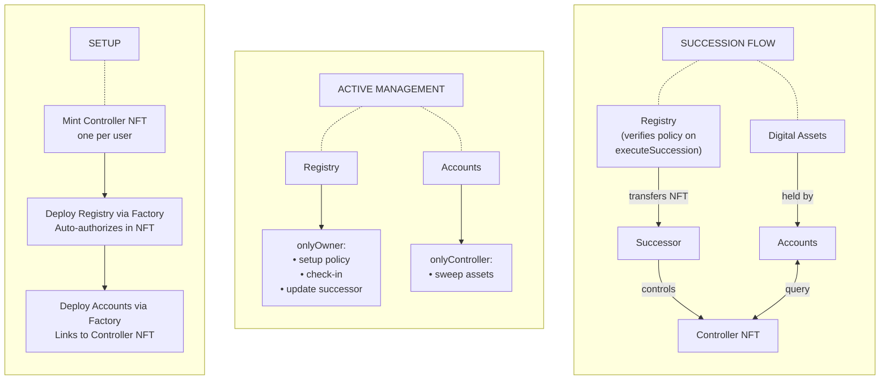

## Abstract

This EIP proposes a standard for NFT-controlled smart contract accounts with programmable succession logic. A Controller NFT represents control authority over linked accounts (Succession-Controlled Accounts). When the NFT transfers according to predefined succession policies managed by a registry contract, control of all linked accounts automatically transfers to the new holder. This enables trustless digital estate planning, organizational treasury continuity, and seamless authority delegation.

The standard defines three core interfaces: IControllerNFT (succession-enabled ERC-721), INFTLinked (succession-capable contracts), and ISuccessionRegistry (policy management). This architecture separates asset custody from succession logic, enabling flexible policy implementations while maintaining composability with existing DeFi protocols and token standards.

---

## Motivation

### **The Problem**

Digital assets don't have succession mechanisms. When someone dies or loses access:

- Smart contract ownership doesn't transfer automatically
- Assets are scattered across wallets, protocols, and chains
- Successors must locate and claim each asset individually
- Yield-generating positions lose value during delays
- DeFi positions, DAO votes, and time-locked assets expire
- Centralized custody solutions defeat the purpose of self-custody

---

### **This Standard's Solution**

This EIP provides a minimal set of interfaces that enable:

**Programmable Succession** - Time-based policies in the reference, but the minimal interface design supports guardian-approved, oracle-triggered, or any custom logic implementing ISuccessionRegistry.

**Unified Control** - One Controller NFT represents authority over an entire estate. All linked accounts query this NFT to determine the current controller via `getCurrentNFTController()`.

**Automatic Recognition** - When the NFT transfers through succession, every INFTLinked contract automatically recognizes the new controller. No state changes needed in the controlled accounts.

**Self-Custody** - Users deploy their own registries and accounts. No centralized service, no ongoing fees, no trusted intermediaries.

**Composability** - The INFTLinked pattern composes with any contract interface, enabling integration with existing standards.

---

### **Use Cases**

**Personal Estate Planning:**
- Crypto inheritance, NFT collections, DeFi positions

**Organizational Treasury Continuity:**
- DAO/company treasury succession, non-profit board rotation

**Trust Structures:**
- Multi-beneficiary estates, professional trustees

---

### **Comparison to Existing Approaches**

Several approaches address aspects of key recovery or asset management, but none provide comprehensive succession planning:

#### **Social Recovery** (ERC-4337, Safe, Argent):
- Designed for emergency key loss, not planned succession
- Requires active guardian coordination per recovery event
- No automatic time-based transfer mechanism

**Difference**: This standard provides passive, time-based succession without requiring guardian action

#### **Token Bound Accounts** (ERC-6551):
- NFTs can own accounts, but no succession logic
- Immediate transfers with no conditional policies
- No inactivity detection or proof-of-life mechanism

**Difference**: This standard adds programmable succession policies to NFT-controlled accounts

**Theoretical Complementary Use:** Controller NFTs could own ERC-6551 Token Bound Accounts. Succession of the Controller NFT should transfer TBA control, though this integration has not been tested.

**Reference:** [ERC-6551: Non-fungible Token Bound Accounts](https://eips.ethereum.org/EIPS/eip-6551)

#### **Token-Level Inheritance** (ERC-7878):
- Individual tokens implement Bequeathable interface for inheritance
- Executors announce obituaries to trigger token transfers
- Moratorium period before transfer completes
- Requires token issuers to add inheritance logic

**Difference**: This standard operates at account level without modifying tokens - any existing ERC-20/721/1155 can be inherited via controlled accounts

**Complementary Use:** A Bequeathable token (ERC-7878) held in a Succession-Controlled Account provides layered protection - token-level inheritance + account-level succession.

**Reference:** [ERC-7878: Bequeathable Tokens](https://ethereum-magicians.org/t/erc-7878-bequeathable-tokens-a-standard-to-allow-tokens-to-be-inherited-after-the-owners-death/22755)

#### **EOA Inheritance via EIP-7702**:
- Uses EIP-7702 delegation for EOA inheritance
- Passive inactivity detection via "proof of unchanged nonce"
- Single inheritor per EOA

**Difference**: This standard works at controlled account level with flexible policy types (time/guardian/oracle/DAO) and enables complex organizational succession.

**Complementary Use:** An EOA with EIP-7702 inheritance controlling a Succession-Controlled Account provides defense-in-depth - EOA-level recovery + account-level succession policies.

**Reference:** [EOA Inheritance/Recovery over Inactivity (with EIP-7702)](https://ethereum-magicians.org/t/eoa-inheritance-recovery-over-inactivity-with-eip-7702/25382)

#### **Dead Man's Switch Solutions** (Sarcophagus):
- Threshold cryptography with encrypted data recovery
- Requires off-chain storage dependencies (Arweave)
- Focuses on data recovery rather than asset control transfer

**Difference**: This standard provides on-chain-only asset custody transfer

#### **Custodial Services** (Casa):
- Multisig inheritance with human support
- Requires ongoing fees and trust in service provider
- Centralized infrastructure

**Difference**: This standard enables self-custodial, permissionless succession with one-time deployment costs

#### **Multisig Wallets**:
- Require active coordination from multiple parties
- No automatic transfer mechanism after time delays
- Complex setup for non-technical users

**Difference**: This standard provides automatic time-based succession

#### **Key Differentiators:**

This standard uniquely combines:
- Fully on-chain operation (no off-chain dependencies)
- Automatic time-based execution (no active recovery required)
- Generic interface (works with any NFT-controlled account)
- Self-custodial (no service fees or trusted intermediaries)
- Policy flexibility (time-based, guardian-approved, oracle-triggered, DAO-voted)
- Account-level succession (works with existing tokens without modification)
- No protocol changes required (works on any EVM-compatible chain)

---

### **Scope**

**This standard provides:**
- Technical infrastructure for programmable succession
- On-chain policy enforcement and execution
- Composable interfaces for DeFi integration
- Base pattern (INFTLinked) for succession-enabled contracts

**This standard does NOT provide:**
- Legal estate planning documents or advice
- Automatic cross-chain synchronization
- Tax/legal compliance features
- Custodial services or insurance
- Replacement for traditional wills/trusts

**Legal Notice:** Technical succession mechanisms do not replace legal estate planning requirements. Users should consult qualified professionals regarding estate planning, corporate governance, tax implications, and regulatory compliance. See [Security Considerations - Legal and Regulatory Risks](https://github.com/perdura/succession-controlled-accounts/blob/main/docs/SecurityConsiderations.md#legal-and-regulatory-considerations) for detailed analysis.

---

## Specification

The key words "MUST", "MUST NOT", "REQUIRED", "SHALL", "SHALL NOT", "SHOULD", "SHOULD NOT", "RECOMMENDED", "NOT RECOMMENDED", "MAY", and "OPTIONAL" in this document are to be interpreted as described in RFC 2119 and RFC 8174.

**Terminology Note:** This specification uses "successor" to describe the person designated to gain control after succession conditions are met. The reference implementation code uses `beneficiary` as the variable name for this address. These terms refer to the same concept.

### **Overview**

This standard defines a pattern for NFT-controlled contracts with automatic succession. The standard consists of three required interfaces that work together to enable trustless digital succession.

For visual representation of these interfaces and flows, see the [Diagrams](https://github.com/perdura/succession-controlled-accounts/blob/main/docs/Diagrams.md).

#### **REQUIRED (Core Standard):**

These interfaces MUST be implemented for compliance:

1. **INFTLinked** - Foundation interface that contracts implement to enable automatic succession
2. **IControllerNFT** - Succession-enabled ERC-721 NFT that tracks control authority
3. **ISuccessionRegistry** - Policy management and NFT transfer execution

**Why These Three Are Required:**

- **Without INFTLinked:** No standard way for contracts to recognize succession
- **Without IControllerNFT:** No NFT to represent succession authority
- **Without ISuccessionRegistry:** No mechanism to actually transfer the NFT (succession impossible)

**How they work together:**

Controlled accounts check the Controller NFT for current authority. The Succession Registry transfers the NFT when policy conditions are met. All controlled accounts automatically recognize the new controller.

**IMPLEMENTATION FREEDOM:**

While the three core interfaces are REQUIRED, implementations have significant freedom:

ISuccessionRegistry implementations MAY vary in:
- Policy structures (time-based, guardian-approved, oracle-triggered, multi-successor, governance-controlled)
- Wait periods (custom durations from hours to years)
- Trigger mechanisms (time, guardians, oracles, on-chain conditions, off-chain proofs)
- Successor models (single, multiple, conditional, gradual release)

The reference implementation demonstrates time-based succession. Other valid implementations could use different approaches (guardian-based, oracle-triggered, multi-successor, etc.).

---

#### **RECOMMENDED (Deployment Pattern):**

The factory pattern is RECOMMENDED for production deployments:

**Factory Interfaces** (located in `deployment/`):
- **IRegistryFactory** - General pattern for registry deployment
- **IAccountFactory** - General pattern for account deployment

**Factory Implementations:**
- **RegistryFactory** ([`reference/RegistryFactory.sol`](https://github.com/perdura/succession-controlled-accounts/blob/main/contracts/reference/RegistryFactory.sol)) - Deploys succession registries
- **AccountFactory** ([`reference/vault/AccountFactory.sol`](https://github.com/perdura/succession-controlled-accounts/blob/main/contracts/reference/vault/AccountFactory.sol)) - Vault-specific implementation

**Important:** The AccountFactory in `reference/vault/` is specifically for SimpleAccount vaults. Other account types (ERC-6551, ERC-4626) would have their own factory implementations following the IAccountFactory pattern.

Factories provide:
- 81% gas savings (EIP-1167 minimal proxies)
- Automatic registry authorization
- One-transaction deployment
- Prevents deployment errors

See [Deployment Pattern](#part-2-deployment-pattern-recommended) section for detailed rationale.

---

#### **OPTIONAL (Asset Custody):**

Succession can work WITHOUT custody accounts. Assets can be held:
- In ERC-6551 Token Bound Accounts (implement INFTLinked)
- In custom custody contracts (implement INFTLinked)
- In reference vault implementation (IControlledAccount pattern)

**Reference Vault Implementation:**

The standard includes a complete multi-asset vault as a reference implementation:
- **IControlledAccount** - Example vault interface (located in `reference/vault/`)
- **SimpleAccount** - Example vault implementation
- **AccountFactory** - Vault-specific factory

This demonstrates ONE approach to custody. Other account types (ERC-6551, ERC-4626 vaults, vesting contracts) would follow similar patterns but with different interfaces and implementations.

---

#### **Architecture Summary:**


---

#### **Simplified Flow:**


**Note:** "NFT-Linked Contracts" can be any contract implementing INFTLinked (vaults, ERC-6551 accounts, ERC-4626 contracts, etc.). The reference implementation uses SimpleAccount vaults, but other account types are equally valid. After succession completes, the Successor gains control of all NFT-Linked Contracts and their assets through the transferred Controller NFT.

---

#### **Architecture Components**

The standard defines three core interfaces and provides reference implementations:

**CORE INTERFACES (Required):**

1. **INFTLinked Pattern**: 
   - Foundation interface for any succession-enabled contract
   - Provides getCurrentNFTController() for access control
   - Automatic succession recognition when NFT transfers
   - Makes any contract succession-capable

2. **Controller NFT (IControllerNFT)**: 
   - Represents succession authority
   - One mint per user with inheritance support
   - Authorizes registries for NFT transfers
   - Tracks inheritance chain

3. **Succession Registry (ISuccessionRegistry)**: 
   - Manages succession policies (time-based, guardian-approved, or custom)
   - Executes NFT transfers when conditions are met
   - One registry per user (enforced by factory)

**DEPLOYMENT PATTERN (Recommended):**

4. **Factories (IRegistryFactory, IAccountFactory)**: 
   - Deploy clones using EIP-1167 minimal proxy pattern
   - Auto-authorize registries in Controller NFT
   - Verify user has minted NFT before deployment
   - 81% gas savings vs full deployments

**REFERENCE IMPLEMENTATION (Example):**

5. **Vault (IControlledAccount + SimpleAccount)**:
   - Demonstrates INFTLinked pattern for multi-asset custody
   - Holds Native, ERC20, ERC721, ERC1155 tokens
   - ONE example - other account types are equally valid
   - Location: `reference/vault/`

---

#### Component Interaction Flow


**Key Insight:** Succession happens at the NFT level. All linked accounts automatically recognize the new controller via getCurrentNFTController().

---

### **Part 1: Core Protocol Interfaces**

These three interfaces define the succession pattern and MUST be implemented for compliance with this standard.

#### **1.1 INFTLinked**

Foundation interface for all succession-enabled contracts. This is the fundamental pattern that enables automatic succession by linking any contract to a Controller NFT.
```solidity
interface INFTLinked {
        
    /// @notice Thrown when caller is not the current controller
    error NotNFTController();
        
    /// @notice Emitted when contract is linked to a Controller NFT
    event NFTLinkingInitialized(address indexed controllerNFT, address indexed originalHolder);
        
    /// @notice Get the current controller of this contract
    function getCurrentNFTController() external view returns (address controller);
    
    /// @notice Get the Controller NFT contract that verifies authority
    function getControllerNFT() external view returns (address nft);
    
    /// @notice Get the original holder linked to the contract this interface extends to
    function getOriginalHolder() external view returns (address holder);
    
    /// @notice Check if succession has occurred
    function hasSuccessionOccurred() external view returns (bool);
}
```

**Complete interface** is available in the repository: [`interfaces/INFTLinked.sol`](https://github.com/perdura/succession-controlled-accounts/blob/main/contracts/interfaces/INFTLinked.sol)

**Requirements:**

1. **Authorization Error**: 
   - The `NotNFTController` error MUST be defined in this interface
   - Implementations MUST use this error for consistent error messaging across all succession-enabled contracts
   - This ensures unified error handling in dApp integrations

2. **Immutable Linking**: 
   - Once initialized, the `controllerNFT` and `originalHolder` addresses MUST NOT change
   - Implementations MUST store these as immutable or prevent re-initialization

3. **getCurrentNFTController() Implementation**: 
   - Implementations MUST implement this by calling `IControllerNFT(controllerNFT).getCurrentController(originalHolder)`
   - This MUST be the source of truth for access control

4. **Access Control Pattern**: 
   - Implementations MUST enforce access control by verifying `getCurrentNFTController()` matches `msg.sender`
   - The reference implementation provides `NFTLinked` abstract contract with an `onlyController` modifier:
    ```solidity
    modifier onlyController() {
        address controller = getCurrentNFTController();
        if (controller == address(0) || msg.sender != controller) {
            revert NotNFTController();
        }
        _;
    }
    ```
   - Contracts inheriting from `NFTLinked` automatically gain this modifier
   - Alternative implementations MAY implement access control differently while maintaining the same security guarantees

5. **Automatic Succession**: When the Controller NFT transfers, control MUST automatically transfer WITHOUT requiring state changes in the linked contract

6. **Succession Transparency**: The `hasSuccessionOccurred()` function SHOULD return true when the current controller differs from the original holder

**Compliance Requirement:** All contracts wanting automatic succession MUST implement INFTLinked. The reference implementation provides `NFTLinked.sol`, an abstract contract developers can inherit from to automatically gain the `onlyController` modifier. See [Reference Implementation](#reference-implementation).

**Design Rationale:** INFTLinked defines the pattern that enables succession. Contracts inherit from the NFTLinked base contract (which implements INFTLinked) to automatically gain succession capabilities through the `onlyController` modifier that queries the Controller NFT.

---

#### **1.2 IControllerNFT**

Succession-enabled ERC-721 token that tracks control authority.
```solidity
interface IControllerNFT is IERC721 {
        
    /// @notice Thrown when address already minted their Controller NFT
    error AlreadyMinted();
    
    /// @notice Thrown when attempting transfer without registry authorization
    error RegistryLinkedToken();
        
    /// @notice Emitted when a Controller NFT is minted
    event ControllerNFTMinted(address indexed to, uint256 indexed tokenId);

    /// @notice Emitted when registry authorization changes
    event RegistryAuthorized(address indexed user, address indexed registry, bool authorized);

    /// @notice Mint a Controller NFT
    function mint() external;
        
    /// @notice Authorizes a registry for NFT succession transfers
    function authorizeRegistry(address user, address registry) external;

    /// @notice Check if registry is authorized to transfer user's NFT
    function isAuthorizedRegistry(address user, address registry) external view returns (bool);
    
    /// @notice Get current controller
    function getCurrentController(address originalHolder) external view returns (address controller);
    
    /// @notice Get original token ID minted by user
    function originalTokenId(address user) external view returns (uint256 tokenId);

    /// @notice Check if address has minted their Controller NFT
    function hasMinted(address user) external view returns (bool minted);
}
```

**Complete interface** including all natspec is available in the repository: [`interfaces/IControllerNFT.sol`](https://github.com/perdura/succession-controlled-accounts/blob/main/contracts/interfaces/IControllerNFT.sol)

**Access Control:**

Implementations have flexibility in restricting `authorizeRegistry()`:
- MAY restrict to trusted factories only (better UX, requires factory trust)
- MAY allow users to call directly (trustless, requires extra transaction)
- MAY use governance approval (DAO/multisig authorization)
- MUST implement some authorization protection to prevent malicious registries

**Dual Verification Pattern:**

Implementations SHOULD verify both:
1. The caller is authorized (trusted factory, NFT owner, governance, etc.)
2. The registry is properly owned/tracked

This defense-in-depth approach prevents authorization of malicious registries even if one verification layer is compromised.

See [Part 2 (Deployment Pattern)](#part-2-deployment-pattern-recommended) for detailed factory rationale and the [Reference Implementation](#reference-implementation) section for the factory-restricted approach.

**Requirements:**

1. **One Mint Per Address**: 
   - Implementations MUST allow each address to mint exactly one Controller NFT
   - The `mint()` function MUST revert if called by an address that has already minted
   - Addresses MAY hold multiple NFTs through inheritance

2. **Registry-Linked Transfers**: 
   - Implementations MUST NOT allow transfers via standard ERC-721 mechanisms
   - Transfers MUST only occur through authorized registries
   
   **Reference Implementation Approach:**
   - Overrides `_update()` to validate registry authorization before transfers
   - This blocks ALL transfer paths (`transferFrom()`, `safeTransferFrom()`, etc.) at the internal level
   - Transfer functions may execute but fail authorization in `_update()`
   - `approve()` and `setApprovalForAll()` behavior depends on `_isAuthorized()` override

3. **getCurrentController()**: Implementations MUST implement this function such that it:
   - Returns the current owner of the NFT if the original holder minted and the NFT exists
   - Returns `address(0)` if the original holder never minted OR the NFT was burned
   - Provides the source of truth for all access control in linked contracts

4. **Registry Authorization**: 
   - Only authorized registries MAY transfer the NFT
   - Authorization MAY be granted through:
     - **Factory Authorization**: Trusted factories call `authorizeRegistry()` during deployment (better UX, requires trust in factory)
     - **User Authorization**: NFT holder calls `authorizeRegistry()` directly (trustless, extra transaction)
     - **Governance Approval**: DAO/multisig authorizes registries (organizational use)
     - **Custom Mechanisms**: Implementation-specific patterns
   - Authorization state MUST be queryable via `isAuthorizedRegistry(user, registry)`
   - Implementations SHOULD implement dual verification (caller authorization + registry ownership validation) to prevent malicious registry authorization

5. **Inheritance Griefing Protection**: 
   - Implementations MUST protect against inheritance griefing attacks
   - See [Security Requirements](#security-requirements) section for valid protection strategies
   - The interface does not prescribe HOW to protect (implementation freedom)

**Compliance Requirement:** All succession-enabled systems MUST use a Controller NFT implementing this interface.

---

#### **1.3 ISuccessionRegistry**

Policy management and NFT transfer execution. Succession cannot work without a registry that transfers the NFT when conditions are met.
```solidity
interface ISuccessionRegistry {
        
    /// @notice Emitted when succession executes successfully
    event SuccessionExecuted(address indexed from, address indexed to, uint256 tokenCount);
    
    /// @notice Execute succession and transfer Controller NFTs to successor
    function executeSuccession() external;
}
```

**Complete interface** is available in the repository: [`interfaces/ISuccessionRegistry.sol`](https://github.com/perdura/succession-controlled-accounts/blob/main/contracts/interfaces/ISuccessionRegistry.sol)

**Requirements:**

1. **Policy Implementation Freedom**:
   - Implementations MAY use ANY policy structure:
     - Time-based (inactivity periods)
     - Guardian-approved (multi-signature)
     - Oracle-triggered (off-chain events)
     - Conditional (on-chain state checks)
     - Multi-successor (gradual or split distributions)
     - Governance-controlled (DAO/multisig)
   - The reference implementation provides time-based succession
   - Other valid implementations could use entirely different approaches

2. **executeSuccession()**: 
   - This is the REQUIRED core function that MUST exist in all implementations
   - MUST verify succession conditions before transferring
   - MUST be authorized in IControllerNFT to transfer NFTs
   - MUST protect against inheritance griefing (see [Security Requirements](#security-requirements))
   - MUST emit SuccessionExecuted event

3. **Access Control**:
   - The registry MUST query Controller NFT for authorization
   - Policy configuration functions SHOULD be restricted to registry owner
   - `executeSuccession()` authorization is implementation-specific (successor-only, public, executor role, etc.)

**Compliance Requirement:** All succession systems MUST include a registry implementing this interface. The registry is what actually executes the NFT transfer.

---

### **Part 2: Deployment Pattern (Recommended)**

The standard defines a recommended deployment pattern using factory contracts. This pattern is OPTIONAL but provides significant security and UX benefits.

**Why Factories Are Recommended:**

1. **Security**: Atomic deployment + authorization (no vulnerability window)
2. **Gas Efficiency**: EIP-1167 minimal proxies (~81% savings)
3. **User Experience**: One-transaction setup
4. **Error Prevention**: Factories ensure proper initialization

**Alternative Deployment Methods:** Implementations MAY skip factories and deploy manually. However, they must provide equivalent security for registry authorization.

Factories require users to have a valid Controller NFT:
- User must have minted a Controller NFT (`hasMinted`)
- Token must not be burned (`getCurrentController != address(0)`)

Both checks must pass or the transaction reverts. This prevents the deployment of unusable clones.

---

#### **2.1 IRegistryFactory**

Factory interface for deploying succession registries with atomic authorization.
```solidity
interface IRegistryFactory {
        
    /// @notice Emitted when registry is created
    event RegistryCreated(address indexed user, address indexed registry);
    
    /// @notice Emitted when pause state changes
    event PausedSet(bool paused);
        
    /// @notice Deploy succession registry for caller
    function createRegistry() external returns (address registry);
        
    /// @notice Pause registry creation
    function setPaused(bool paused) external;

    /// @notice Get user's registry address
    function userRegistry(address user) external view returns (address registry);

    /// @notice Check if factory is paused
    function paused() external view returns (bool isPaused);
        
    /// @notice Get total number of deployed registries
    function getRegistryCount() external view returns (uint256 count);
    
    /// @notice Get paginated list of all registries
    function getRegistriesPaginated(uint256 start, uint256 count) 
        external 
        view 
        returns (address[] memory registries);
    
    /// @notice Get Controller NFT contract address
    function getControllerNFT() external view returns (address nft);
    
    /// @notice Get registry implementation address being cloned
    function getImplementation() external view returns (address implementation);
}
```

**Complete interface** with full natspec is available in the repository: [`deployment/IRegistryFactory.sol`](https://github.com/perdura/succession-controlled-accounts/blob/main/contracts/deployment/IRegistryFactory.sol)

**Integration with Core:**

Factory implementations call `IControllerNFT.authorizeRegistry()` during deployment to enable succession. This is the key integration point between the deployment pattern and the core protocol.

**Access Pattern:** IControllerNFT implementations MAY restrict `authorizeRegistry()` to trusted factories (implementation-specific authorization check) to ensure only audited implementations are authorized. Alternative implementations MAY allow user-callable authorization for trustless deployment.

**Key Features:**

1. **One Registry Per User**: Prevents policy conflicts and confusion
2. **Auto-Authorization**: Uses IControllerNFT's factory integration
3. **NFT Verification**: Requires user to mint Controller NFT first
4. **Gas Efficient**: ~272k gas vs ~1.37M for full deployment (80.1% savings)

**Why Atomic Authorization Matters:**

Without atomic authorization, there's a vulnerability window:
1. User deploys registry (transaction 1)
2. **Window of vulnerability**
3. User authorizes registry (transaction 2)

During this window:
- Attacker could front-run authorization
- User could make mistakes in authorization
- Gas price spikes could delay authorization

The factory pattern eliminates this risk entirely.

**See:** Reference implementation in [`reference/RegistryFactory.sol`](https://github.com/perdura/succession-controlled-accounts/blob/main/contracts/reference/RegistryFactory.sol)

---

#### **2.2 IAccountFactory**

Factory interface for deploying controlled accounts.
```solidity
interface IAccountFactory {
        
    /// @notice Emitted when account is created
    event AccountCreated(address indexed user, address indexed account, uint256 indexed chainId);
    
    /// @notice Emitted when pause state changes
    event PausedSet(bool paused);
        
    /// @notice Deploy controlled account for caller
    function createAccount() external returns (address account);
        
    /// @notice Pause account creation
    function setPaused(bool paused) external;
    
    /// @notice Check if factory is paused
    function paused() external view returns (bool isPaused);

    /// @notice Get all accounts created by user
    function getUserAccounts(address user) external view returns (address[] memory accounts);
    
    /// @notice Get number of accounts created by user
    function getUserAccountCount(address user) external view returns (uint256 count);

    /// @notice Get total number of deployed accounts
    function getAccountCount() external view returns (uint256 count);
    
    /// @notice Get paginated list of all accounts
    function getAccountsPaginated(uint256 start, uint256 count) 
        external 
        view 
        returns (address[] memory accounts);
    
    /// @notice Get Controller NFT contract address
    function getControllerNFT() external view returns (address nft);
    
    /// @notice Get account implementation address being cloned
    function getImplementation() external view returns (address implementation);
    
    /// @notice Get maximum accounts per user
    function getMaxAccountsPerUser() external view returns (uint256 max);
}
```

**Complete interface** with full natspec is available in the repository: [`deployment/IAccountFactory.sol`](https://github.com/perdura/succession-controlled-accounts/blob/main/contracts/deployment/IAccountFactory.sol)

**Important:** This interface defines the PATTERN. Actual factory implementations are specific to the account type being deployed:

- **Vault Factory** Deploys SimpleAccount vaults
- **ERC-6551 Factories**: Could deploy succession-enabled 6551 accounts
- **Trust Vault Factories**: Could deploy ERC-4626 trust vaults with succession
- **Custom Factories**: Any account type following INFTLinked pattern

**Key Features:**

1. **Multiple Accounts**: Users can deploy many accounts for different purposes
2. **DoS Protection**: Enforces account limits (reference: MAX_ACCOUNTS_PER_USER = 25)
3. **No Auto-Authorization**: Accounts don't transfer Controller NFTs, so no authorization needed
4. **Gas Efficient**: ~266k gas per account vs ~1.44M full deployment (81.5% savings)

**Why Multiple Accounts Per User:**

Users may deploy multiple accounts for:
- Asset separation (personal vs business)
- Asset categories (tokens, NFTs, yield in separate accounts)
- Privacy (different accounts for different contexts)
- Risk management (isolate high-risk assets)
- Successor-specific (dedicated account per successor)

**See:** Reference implementation in [`reference/AccountFactory.sol`](https://github.com/perdura/succession-controlled-accounts/blob/main/contracts/reference/vault/AccountFactory.sol)

---

### **Security Requirements**

#### **Inheritance Griefing Protection (REQUIRED)**

All implementations MUST provide protection against inheritance griefing attacks where malicious actors transfer large numbers of junk Controller NFTs to beneficiaries to prevent estate succession.

**The Vulnerability**

Without protection, attackers can send thousands of junk NFTs to beneficiaries, causing `executeSuccession()` to fail due to:
- Gas exhaustion (iterating unbounded arrays)
- Storage limits (arrays too large)
- Economic DoS (transfer cost exceeds estate value)

**Example Attack:**
```solidity
// Attacker sends 10,000 junk NFTs to successor
for(uint i = 0; i < 10000; i++) {
    junkNFT.mint();
    junkNFT.transfer(successor);
}

// Succession transfer fails - successor cannot inherit
registry.executeSuccession(); // REVERTS or runs out of gas
```

**Why This Requirement Exists**

The ERC-4626 inflation attack demonstrated that documenting vulnerabilities is insufficient if developers implement perceived solutions (unbounded arrays) and get exploited. This standard requires protection while allowing implementation flexibility.

**Compliant Protection Strategies**

Implementations MUST use at least one strategy:

**1. Storage Limits** (Reference Implementation)
- Enforce maximum inherited tokens (e.g., MAX_INHERITED_TOKENS = 8)
- Provide burn function for clearing spam
- Support partial transfers when limit reached
- Simple, predictable, on-chain only

**2. Off-Chain Indexing**
- Track ownership via events, not arrays
- No iteration needed on-chain
- Scales infinitely, minimal gas

**3. Access Control**
- Whitelist trusted NFT senders only
- Prevents griefing at source
- Centralized but simple

**4. Gas-Bounded Transfers**
- Transfer until gas limit approached
- Natural scaling with network capacity
- Unpredictable UX

**5. Economic Barriers**
- Charge fees for NFT transfers
- Makes griefing expensive
- May affect legitimate use

**6. Pagination**
- Multi-transaction claiming
- No hard limits
- More complex UX

**Implementation Requirements**

Implementations MUST:
- Document which strategy is used
- Test with 1000+ token adversarial scenarios
- Document any limits and user recovery paths
- Measure gas costs at scale

**Reference Implementation:** Uses Storage Limits (Strategy 1) with MAX_INHERITED_TOKENS = 8. See [`reference/ControllerNFT.sol`](https://github.com/perdura/succession-controlled-accounts/blob/main/contracts/reference/ControllerNFT.sol) and [`reference/SimpleSuccessionRegistry.sol`](https://github.com/perdura/succession-controlled-accounts/blob/main/contracts/reference/SimpleSuccessionRegistry.sol) for complete implementation.

---

## Rationale

### **Why NFT-Based Control?**

- **Composability**: NFTs integrate with existing marketplaces, wallets, and protocols. The Controller NFT itself could theoretically be sold, lent, or used as collateral (though succession registries would prevent unauthorized transfers).

- **Unified Authority**: A single NFT represents control over an entire estate, simplifying management compared to per-account authorization.

- **Potential ERC-6551 Integration**: Controller NFTs could theoretically work with ERC-6551 Token Bound Accounts for unified custody with programmable succession, though this integration pattern requires further testing and community feedback.

- **Potential ERC-4626 Integration**: The standard could theoretically enable trust structures where a Controller NFT holder manages an INFTLinked ERC-4626 vault with distributed share ownership. This pattern has not been implemented or tested and would require careful design of the trustee/beneficiary relationship.

### **Why Separate Registry from NFT?**

- **Flexibility**: Different users may want different succession policies without requiring NFT contract upgrades.

- **Privacy**: Each user deploys their own registry clone. Succession policies, beneficiaries, and check-in activity remain isolated (not stored in a shared contract visible to all users).

- **Specialization**: NFT focuses on ownership and transfers; registry focuses on policy logic.

### **Why Clone Pattern (EIP-1167)?**

- **Privacy**: Users deploy their own clones rather than sharing a central contract.

- **Decentralization**: No single entity controls all registries/accounts.

- **Gas Efficiency**: Factory deployment provides substantial savings vs full contract deployment. Based on actual test results:
   - Registry via factory: ~272k gas (vs ~1.37M full deployment = 80.1% savings)
   - Account via factory: ~266k gas (vs ~1.44M full deployment = 81.5% savings)
   - Combined savings: ~81% average

### **Policy Implementation Flexibility**

The standard's minimal ISuccessionRegistry interface enables multiple policy implementations:

- **Time-Based Policies** (Reference Implementation): 
Suitable for individuals with trusted successors. After a configured inactivity period (e.g., 6 months or 1 year), the successor can execute the transfer. Regular check-ins reset the timer. Simple, predictable, fully on-chain.

- **Guardian-Approved Policies**: 
The minimal interface design enables implementations requiring guardian signatures before succession. Useful for high-value estates or organizations requiring additional authorization. Any contract implementing ISuccessionRegistry can add guardian logic, multi-sig requirements, or other authorization schemes.

- **Oracle-Triggered Policies**: 
Implementations can integrate off-chain verification (death certificates, legal documents) via oracles. Enables hybrid on-chain/off-chain succession models.

- **Governance-Controlled Policies**: 
DAO-voted succession for organizational treasuries. Token holders or governance contracts can approve succession execution.

- **Multi-Successor Policies**: 
Gradual release schedules, conditional distributions, or split allocations. Enables complex trust structures and family wealth planning.

- **Custom Policies**: 
The minimal interface enables any succession logic as long as it implements executeSuccession() and protects against griefing attacks.

The reference implementation demonstrates time-based policies with proof-of-life check-ins. Alternative implementations using different policy types are equally valid.

---

## Backwards Compatibility

This EIP is fully backwards compatible with existing standards and designed to extend them:

**ERC-721**: Controller NFT extends standard NFT functionality. The RegistryLinkedToken transfer restriction (blocking `approve`/`setApprovalForAll`) is a deliberate security design that doesn't break ERC-721's core ownership model.

**EIP-1167**: Factories use the minimal proxy pattern for gas-efficient deployment.

**ERC-6551**: Designed for potential integration where Controller NFTs could own Token Bound Accounts. Succession should transfer TBA control, though this pattern has not been verified in practice. Feedback from ERC-6551 implementers is welcome.

**ERC-4626**: INFTLinked contracts could theoretically implement ERC-4626 patterns for tokenized vaults with succession. This could enable trust structures, though the interaction between vault share ownership and succession control requires further exploration.

No breaking changes to existing standards. The INFTLinked pattern is designed to compose with any existing interface.

---

## Reference Implementation

A complete reference implementation is available at: [github.com/perdura/succession-controlled-accounts](https://github.com/perdura/succession-controlled-accounts)

**Core Components:**
- [`ControllerNFT.sol`](https://github.com/perdura/succession-controlled-accounts/blob/main/contracts/reference/ControllerNFT.sol) - IControllerNFT with Storage Limits strategy
- [`SimpleSuccessionRegistry.sol`](https://github.com/perdura/succession-controlled-accounts/blob/main/contracts/reference/SimpleSuccessionRegistry.sol) - ISuccessionRegistry with time-based policies
- [`NFTLinked.sol`](https://github.com/perdura/succession-controlled-accounts/blob/main/contracts/reference/NFTLinked.sol) - Abstract base for INFTLinked pattern

**Deployment:**
- [`RegistryFactory.sol`](https://github.com/perdura/succession-controlled-accounts/blob/main/contracts/reference/RegistryFactory.sol) - IRegistryFactory implementation
- [`AccountFactory.sol`](https://github.com/perdura/succession-controlled-accounts/blob/main/contracts/reference/vault/AccountFactory.sol) - IAccountFactory implementation

**Vault Example:**
- [`SimpleAccount.sol`](https://github.com/perdura/succession-controlled-accounts/blob/main/contracts/reference/vault/SimpleAccount.sol) - Multi-asset controlled account (Native/ERC20/721/1155)
- [`IControlledAccount.sol`](https://github.com/perdura/succession-controlled-accounts/blob/main/contracts/interfaces/reference/IControlledAccount.sol) - Vault interface pattern

**Integration Pattern:**

To build succession-enabled contracts:
```solidity
interface IYourContract is INFTLinked {
    function yourFunction() external;
}

contract YourContract is NFTLinked, IYourContract {
    function yourFunction() external onlyController {
        // Access controlled by current NFT owner
    }
}
```

**Implementation Choices:**

The reference demonstrates:
- Inheritance griefing protection: Storage Limits (Strategy 1)
- Policy type: Time-based inactivity with check-ins
- Deployment: EIP-1167 minimal proxies

Alternative approaches using different strategies, policies, or account types are equally valid.

**Implementation Status:**

The reference implementation is complete and tested:
- **Test Coverage:** 209 tests, 97% line coverage, 95% statement coverage
- **Gas Benchmarks:** Available in [`docs/gas-report.txt`](https://github.com/perdura/succession-controlled-accounts/blob/main/docs/gas-report.txt)
- **Audit Status:** Not yet audited - production deployments should undergo independent security audits

All reference code is provided under the MIT License.

---

## Security Considerations

**IMPORTANT:** This standard and its reference implementation have not been formally audited. Projects implementing this standard or deploying the reference implementation MUST undergo independent security audits before production use.

### Access Control After NFT Burn

**Risk**: When a Controller NFT is burned, all linked accounts must become inaccessible to prevent orphaned control.

**Mitigations**: 
- Implementations MUST check that `getCurrentController()` does not return `address(0)` before granting access
- Reference implementation's `onlyController` modifier explicitly validates this condition
- Proper implementation prevents locked funds and unclear error messages

### Accidental Asset Transfers to Infrastructure Contracts

**Risk**: Users may accidentally send assets to contracts not designed for custody (Controller NFT, Registry, or Factory addresses).

**Mitigations**: 
- Only Controlled Accounts are designed to hold user assets
- Core infrastructure contracts serve authorization and deployment purposes only
- Wallets and dApps SHOULD clearly indicate which addresses accept asset deposits
- Users SHOULD verify destination addresses before transfers
- Similar to ERC-20/ERC-721 contracts, sending assets to infrastructure is user error

### Factory Trust

**Risk**: Trusted factories can authorize malicious registry implementations.

**Mitigations**:
- Factory ownership SHOULD be transferred to governance/multisig
- Users SHOULD verify factory and implementation code before use
- Multiple competing factories MAY exist
- ControllerNFT contract owner controls which factories are trusted (implementation-specific access control)
- Trusted factories SHOULD only deploy audited, battle-tested implementations

### Clone Initialization Security

**Risk**: Anyone can deploy clones of implementations and initialize them with arbitrary parameters.

**Mitigations**:
- Such clones are effectively useless (not tracked by factory, not authorized in Controller NFT)
- Factory's `createRegistry()` and `createAccount()` perform atomic deployment + initialization
- Users SHOULD only interact with factory-deployed contracts
- Production implementations MAY add: immutable factory addresses, CREATE2, initialization signatures

### Registry Manipulation

**Risk**: Malicious registries could authorize unauthorized NFT transfers.

**Mitigations**:
- Only authorized registries can transfer the NFT
- NFT contract owner controls which factories can authorize registries (implementation-specific)
- Factory ownership SHOULD be transferred to governance/multisig
- Users SHOULD verify registry implementation code before deployment
- Trusted factories SHOULD only deploy audited implementations

### Registry Implementation Bugs

**Risk**: Buggy registry logic could lock estates or enable unauthorized transfers.

**Mitigations**:
- Thorough audits before deployment
- Battle-testing on testnets
- Time-locks on new registry deployments
- Formal verification where possible
- Community review period

### Registry Authorization Permanence

**Risk**: Permanent registry authorization prevents users from changing succession policies if the registry is buggy, compromised, or no longer suitable.

**Mitigations**:
- **Permanent Authorization Pattern** (Reference): One registry per user, no revocation. Prevents factory DoS but requires careful policy selection. Users can sweep assets to new wallet if registry fails.
- **Revocable Authorization Pattern** (Alternative): Allow revocation with DoS protections (rate limits, maximum registries per user, cooldown periods).
- **Upgradeable Registry Pattern** (Alternative): Registry supports policy upgrades while keeping authorization stable.
- Thorough testing and audits of registry logic before deployment
- Clear documentation of authorization model for users

### Wallet Compromise

**Risk**: Attackers who gain access to the wallet holding the Controller NFT gain control of all linked accounts.

**Note**: The Controller NFT cannot be stolen via normal ERC-721 transfer methods. The `approve()`, `setApprovalForAll()`, and direct `transferFrom()` functions are restricted. Only authorized succession registries can transfer the NFT. The attack vector is wallet/private key compromise, not NFT theft.

**Mitigations**:
- Store Controller NFTs in hardware wallets
- Use multisig custody for Controller NFT for high-value succession scenarios
- Regular check-in intervals prove continuous legitimate control
- Maintain physical security of hardware wallet devices
- Use separate wallets for Controller NFT vs daily transactions

### Key Loss

**Risk**: Lost private keys prevent check-ins and registry management.

**Impact**: Succession proceeds after inactivity period - this is the design intent.

**Mitigations**:
- Users SHOULD maintain secure key backups for active succession management
- Users SHOULD document succession setup for successors
- Users SHOULD inform successors of Controller NFT location and expected wait period
- Successors SHOULD have off-chain instructions for claiming

### Unclaimed Succession Risk

**Risk:** Multi-generational succession failure when intermediate successors don't claim control before becoming inactive.

**Scenario:** Alice designates Bob as successor, Bob designates Charlie as successor. If Bob becomes inactive without claiming Alice's Controller NFT, Charlie cannot access Alice's assets.

**Design Decision:** The reference implementation restricts succession execution to designated successors only to protect against unwanted succession (tax liabilities, blacklisted assets, litigation exposure).

**Mitigations:**
- Users SHOULD choose successors with life expectancy overlap
- Successors SHOULD claim promptly after eligibility
- Users MAY use parallel legal planning (traditional wills) for multi-generational scenarios
- Alternative implementations MAY support contingent successors or permissionless execution after extended periods

**Impact:** Medium-High for multi-generational estates
**Likelihood:** Low-Medium depending on successor age gaps and claiming behavior

### Multi-Chain Deployments

**Risk**: Registries on multiple chains operate independently. Check-ins on one chain don't affect others.

**Mitigations**:
- Users SHOULD maintain check-in schedules across all chains
- Documentation SHOULD clearly indicate per-chain requirements
- Advanced implementations MAY implement cross-chain synchronization (outside standard scope)

### Legal and Regulatory Compliance

**Risk**: Smart contract succession does not replace legal requirements for estate planning.

**Mitigations**:
- This standard provides technical infrastructure only
- Users MUST consult qualified legal professionals
- Traditional legal documentation (wills, trusts, operating agreements) may be required
- Technical ability to transfer control does not guarantee legal recognition or enforceability
- See [SecurityConsiderations.md](https://github.com/perdura/succession-controlled-accounts/blob/main/docs/SecurityConsiderations.md) for comprehensive analysis

## Copyright

Interfaces and specification: Copyright and related rights waived via [CC0](https://github.com/perdura/succession-controlled-accounts/blob/main/LICENSE-INTERFACES).

Reference implementation: Copyright (c) 2025 Tian. Released under [MIT License](https://github.com/perdura/succession-controlled-accounts/blob/main/LICENSE).